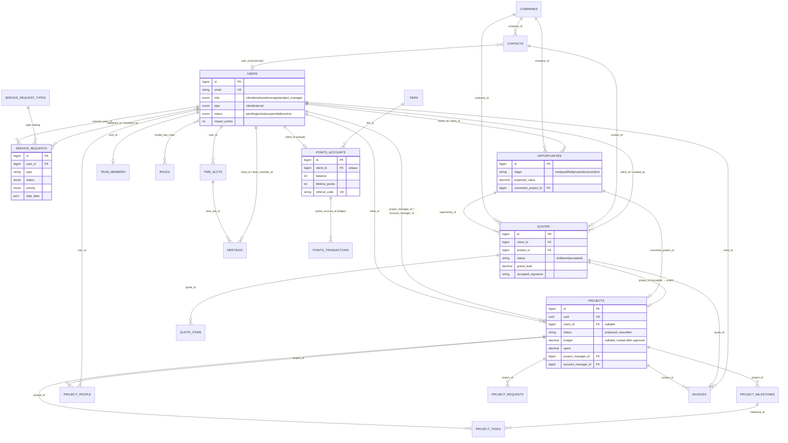

# Vuja Portal — Mobile App Codebase Audit (Phase 0)

*Source of truth for the Flutter mobile build. Every fact below is extracted directly from the `Documents/Vuja Portal` Laravel 12 codebase (read-only audit). Laravel 12 / PHP 8.2+, Sanctum 4.3, spatie/laravel-permission, spatie/medialibrary, bilingual en/ar (RTL), Bootstrap (laravel/ui).*

**Contents:** 0.1 Functional Inventory · 0.2 Data Model · 0.3 Design System · 0.4 Roles & Permissions · 0.5 Forms & Validation · 0.6 API Inventory · 0.7 Proposed Priority List

---

## 0.1 Functional Inventory

The Vuja Portal is a Laravel 12 bilingual (en/ar) innovation-agency portal. One app, role-switched between **internal staff** (`manager`, `employee`, `project_manager`) and **clients**. Routes live in `routes/web.php` (+ required `client.php`, `internal.php`, `projects.php`, `inventory.php`), `routes/api.php` (Sanctum mobile v1), and `routes/console.php`. Roles: `UserRole` = `client | employee | manager | project_manager`; `UserStatus` = `pending | active | suspended | inactive`. Route middleware guards: `auth`, `is_internal`, `is_manager`, `can_manage_projects` (manager + PM).

### Auth & Onboarding
| Method + URI | Name | Controller@method | What it does |
|---|---|---|---|
| — (`Auth::routes(['verify'=>true])`) | login/register/password/verify | Laravel `Auth\*Controller` | Standard email+password auth with email verification; `POST /logout` only (GET removed to close a CSRF vector) |
| GET `/auth/{provider}/redirect` | social.redirect | `Auth\SocialAuthController@redirect` | Start Socialite OAuth for a provider |
| GET `/auth/{provider}/callback` | social.callback | `Auth\SocialAuthController@callback` | OAuth callback → find/create user, log in |
| GET `/invite/{user}/accept` (signed) | invite.accept | `Auth\InviteController@show` | Signed client-invite link: show set-password/activation form |
| POST `/invite/{user}/accept` (signed) | — | `Auth\InviteController@store` | Set password & activate the invited client account |
| GET `/r/{code}` | referral.capture | closure → `ReferralService@rememberCode` | Remember a referral code in session, then redirect to register |
| GET `/language/{locale}` | locale | closure | Switch UI locale (en/ar) in session |

### Dashboard
| Method + URI | Name | Controller@method | What it does |
|---|---|---|---|
| GET `/dashboard` | dashboard | `DashboardController@index` | Role-aware landing; redirects to the correct dashboard |
| GET `/home` | home | closure | Redirects to `dashboard` |
| GET `/client/dashboard` | client.dashboard | `DashboardController@clientDashboard` | Client home (requests, quotes, projects, points) |
| GET `/internal` | internal.dashboard | `DashboardController@internalDashboard` | Staff home |

### Profile
| Method + URI | Name | Controller@method | What it does |
|---|---|---|---|
| GET `/profile` | profile.show | `ProfileController@show` | View own profile |
| GET `/profile/edit` | profile.edit | `ProfileController@edit` | Edit form |
| PUT `/profile` | profile.update | `ProfileController@update` | Update profile fields |
| PUT `/profile/email` | profile.update-email | `ProfileController@updateEmail` | Change email |
| PUT `/profile/password` | profile.update-password | `ProfileController@updatePassword` | Change password |
| PUT `/profile/phone` | profile.update-phone | `ProfileController@updatePhone` | Change phone |
| GET `/profile/security` | profile.security | `ProfileController@security` | Security settings page |
| DELETE `/profile/delete-account` | profile.delete-account | `ProfileController@deleteAccount` | Self-delete account |

### Client Service Requests (7 service lines)
Each line has a client create/show flow and a `manager/{...}` review flow. Shared status/notes/deliverables handled by `ServiceWorkController` (`service-work.*`).

- **Idea Generation** (`ideas.*`, `Services\IdeaRequestController`): create/store/show; AI assessment (`ai-assessment`, `.process`); negotiation + comments; accept/reject-quote; authorized `quote.download` (private disk); payment upload. Manager: `ideas.manager.index/show`, `send-quote`, `approve-quote`, `verify-payment`, `assign`, `close`, `convert-to-project`.
- **Consultation** (`consultations.*`, `Services\ConsultationRequestController`): create/store/show. Manager: index/show, `assign`, `assign-and-schedule`, `send-invite`, `complete`, `convert-to-project`.
- **Research & IP** (`research.*`, `Services\ResearchRequestController`): create/store/show, `sign-documents`, `book-meeting`. Manager: index/show, `assign`, `complete`, `convert-to-project`.
- **Prototype Development** (`prototypes.*`, `Services\PrototypeRequestController`): index/create/store/show, file download. Manager: index/show, file download, `assign`, `update-status`, `convert-to-project`.
- **3D Lab** (printing+design, `threed.*`, `Services\ThreeDRequestController`): index/create/store/show, file download. Manager: index/show, file download, `assign`, `update-status`, `convert-to-project`.
- **IP Registration** (`ip.*`, `Services\IpRegistrationController`): create/store/show, `book-meeting`. Manager: index/show, `assign`, `confirm-meeting`, `update-status`, `convert-to-project`.
- **Copyright Registration** (`copyright.*`, `Services\CopyrightRegistrationController`): create/store/show, `book-meeting`. Manager: index/show, `assign`, `confirm-meeting`, `update-status`, `convert-to-project`.

**Shared Service-Work panel** (`Services\ServiceWorkController`): GET `/service-work/items/{item}/download` (service-work.download; assignee/manager/PM or client-owner if shared); POST `service-work.status`, `service-work.note`, `service-work.deliverable`; DELETE `service-work.delete-item`.

**Unified client views:** GET `/client/my-requests` (client.requests, `ClientRequestsController@index`); GET `/client/services` (services.index, closure view).

**Legacy Service Requests** (`ServiceRequestController`, `Route::resource('service-requests')`): CRUD; manager review-queue (`service-requests.review-queue`), `review`, `assign`.

### Improvement Ideas (portal-improvement suggestions)
| Method + URI | Name | Controller@method | What it does |
|---|---|---|---|
| GET `/improvement-ideas` | improvement-ideas.index | `Services\ImprovementIdeaController@index` | List (role-aware) |
| GET `/improvement-ideas/create` | .create | `@create` | Suggest form (any authed user) |
| POST `/improvement-ideas` | .store | `@store` | Submit idea |
| GET `/improvement-ideas/{improvementIdea}` | .show | `@show` | View idea |
| GET `/internal/improvement-ideas/manager` | .manager.index | `@managerIndex` | Manager review queue |
| GET `.../manager/{improvementIdea}` | .manager.show | `@managerShow` | Manager detail |
| POST `.../{improvementIdea}/approve` | .approve | `@approve` | Approve → awards **150 Impact Points** to author |
| POST `.../{improvementIdea}/reject` | .reject | `@reject` | Reject |

### Stepper (dynamic form-builder service requests)
- **Admin (manager)** `stepper.*`: `Route::resource('service-types')` (`ServiceRequestTypeController`) + step CRUD/reorder; form-field CRUD/reorder (`StepFormFieldController`).
- **Client** `stepper.client.*` (`StepperServiceRequestController`): index, create/store per `{serviceType}`, show, `showStep`, `processStep`.

### Projects (client + internal)
**Client** (`projects.client.*`, `Projects\ProjectController` unless noted): index, show, `add-comment`; milestone `clientApprove` (`MilestoneController`); documents index/store/download (`DocumentController`); deliverable download + `confirmReceipt` (`DeliverableController`); complaint store (`ComplaintController`); request store (`RequestController`); scope-change create/store/clientList/sign (`ScopeChangeController`); feedback create/store (`FeedbackController`).

**Internal** (`projects.*`, `is_internal`): manager.index, `kanban`, propose create/store, proposals.index, proposal approve/reject, manager.show, update, `close`, `update-status`, add-comment; milestones store/update/destroy/`complete` (`MilestoneController`); tasks store/getData/update/comments/destroy (`TaskController`); scope-changes index/approve/reject; expenses index/store/destroy (`ExpenseController`); team add/update/remove; documents update/destroy; deliverables store/destroy; complaint `resolve`; request `respond`. **Manager+PM** (`can_manage_projects`): create/store. **Manager-only**: destroy.

### Quotes & Scope Planner
**Scope Planner** (`ScopePlannerController`, all internal): `scope-planner.index`, `plan`, `save-quote`; staged flow: create/store, show, `suggest`, saveItems (`items`), `generate`, update, `regenerateSection`, `finalize`, `reopen`. **Document render/export** (`Scope\DocumentController`): `document`, `export.pdf`, `view.pdf`, `export.docx`, `technical.pdf`. **Manager scope-prompts** (`ScopePromptController`): edit/update/reset AI prompt templates.

**Quotes internal** (`QuoteController`): index, show, `send`, `assign-client`, `acceptInternal`; approval layer `submit`/`approve`/`reject`/`request-changes`; comments; destroy. **Client** (`client.php`): clientIndex, clientShow, clientAccept (digital signature → order/project), clientReject.

### Invoices & Payments
**Internal** (`InvoiceController`): index, create/store, show, `mark-paid`, `reopen`, `cancel`, file/receipt downloads. **Client**: clientIndex, `uploadReceipt`, downloadFile, downloadReceipt.

### Spend & Reimbursement (`SpendRequestController`)
index, create/store, `approvals`, manager/PM `manage`, `file` download, show/edit/update, `approve`/`reject`, `purchase` (mark bought → posts expense), `reimburse` (pay back), receipt download, destroy. Types = `reimbursement | purchase`; role-routed approvals (PM sees own-project requests); a lone manager self-records (flagged for audit).

### Engagement — Impact Points (internal staff)
| Method + URI | Name | Controller@method | What it does |
|---|---|---|---|
| GET `/internal/engagement` | engagement.index | `EngagementController@index` | Staff points/levels/badges (managers get Owner view) |
| POST `/internal/engagement/thank-you` | engagement.thank-you | `@thankYou` | Send a peer Thank-You token (quota 5/mo, +50 pts to recipient) |
| GET/PUT `/internal/engagement/settings` (+ `/reset`) | engagement.settings.* | `EngagementSettingsController@edit/update/reset` | Manager-tunable Impact-Points rulebook |

### Engagement Points — client loyalty (spec-driven)
**Client** (`ClientEngagementController`): `engagement.client.dashboard`, `about`, `redeem/{option}`, `voucher.apply`, claims store, claim screenshot. **Admin manager** (`Admin\EngagementAdminController`): dashboard, config, updateRule/Redemption/Tier, accounts + account detail + `adjust`, report; pending-earns queue + earn approve/reject. **Grants** (`Admin\EngagementGrantController`, PM suggests / manager approves): index, store, approve, reject. **Claims** (`Admin\EngagementClaimController`, manager): index, approve, reject, screenshot.

### Targets & Capacity
**Staff** (all internal): `/my-targets` (`StaffTargetController@index`, live progress + 6-mo trend); `/capacity` + PUT `/capacity/hours` (`CapacityController`, read-only "my capacity"; hours feed the planner). **Targets admin** (manager, `Admin\TargetController`): index, `set`, delete, `record-month`, `carry-forward`, staff show, metrics CRUD. **Capacity admin** (manager, `Admin\CapacityController`): dashboard, engineers CRUD + skills, leave CRUD, assignments CRUD, submissions.

### Weekly Planner & Availability
**Weekly Planner** (`WeeklyPlannerController`): index, store, `saveDefaults`, `review`, `presence`, show, approve, reject. **Time Slots** (`TimeSlotController`): mySlots, create/store, destroy, `toggle-block`, available/{employeeId}, storeForEmployee; manager teamSlots.

### Meetings
**Client** (`MeetingController`): availableSlots, create/store booking, myMeetings, cancel. **Internal**: myMeetings, `bookInternal`/`storeInternal` (multi-attendee), invitations + accept/decline, confirm, complete.

### Team Chat (internal, `ChatController`)
`chat.index`, `mentions` + `mentions.read-all`, `poll`, `members`, `browse`, attachment download; channels.store, `dm`, message update/destroy/react; show, messages, `older`, messages.store, thread, members add/remove, join request/approve/decline. Polling-based (no websockets); private-disk gated attachments.

### CRM / Sales
**Opportunities** (`OpportunityController`): index, create/store, show, edit/update, `updateStage`, `markLost`, `convert`, destroy. **Companies/Contacts** (`CompanyController` resource; `ContactController` resource minus show). **Quick client** (`ClientQuickController@store`). **Reports** (`CrmReportController@index`). **Activities** (`CrmActivityController`): index, store, complete, destroy. **Pipeline stages** (manager, `PipelineStageController`): index/store/update/move/destroy.

### Manager Ops & Admin
- **Approvals hub**: GET `/internal/approvals` (`ApprovalController@index`) — everything awaiting a manager/PM decision.
- **Staff Tasks** (`StaffTaskController`): index + updateStatus (all internal); create/store/destroy (manager).
- **Control Tower** (`ControlTowerController@index`) — project-health traffic light + risk alerts (manager).
- **Workload** (`WorkloadController`): index + `show/{user}` (heatmap of busy/idle).
- **Financial Report** (`FinancialReportController@index`, manager).
- **Pricing Tool** (`PricingToolController`): tool, getRules, quotingTasks, project quote upload/download; admin rules CRUD (manager).
- **Imports** (manager, `ImportController`): `imports.template/form/store` for contacts/companies/opportunities/projects/tasks.
- **Team/Users** (`TeamInvitationController`): index, invite, store, destroy.
- **Permissions & Roles** (manager, `Permissions\PermissionsController`): index, roles, permissions, users, portal-clients; assign/remove role & permission; create/delete permission; update role permissions; user bulk-delete, delete-unverified, destroy, `activate`.
- **Inventory** (manager, `inventory.php`): `StockItemController` CRUD; `StockImportController` Excel import/template/export (three price tiers; separate from the AI-planner InventoryItem).
- **Notifications** (`NotificationController` index/seen; `NotificationPreferenceController` edit/update per-user email prefs).

### Mobile API v1 (`/api/v1`, Sanctum)
`POST login` (throttle 10/min); auth: `GET me`, `POST logout`, notifications index/seen, `GET engagement` (points/targets snapshot), meetings index/show.

---

### Scheduled Jobs (`routes/console.php` + `app/Console/Commands`)
| Command | Schedule | Purpose |
|---|---|---|
| `planner:mark-overdue` (`MarkOverdueWeeklyPlans`) | Saturdays 18:01 | Mark un-submitted weekly plans overdue (Saturday deadline enforcement) |
| `engagement:expire-points` (`ExpireEngagementPoints`) | daily 02:00 | Expire client engagement points past the 24-month window (FIFO) |
| `targets:snapshot-month` (`SnapshotTargetsMonth`) | monthly 1st 00:30 | Snapshot the just-ended month of performance targets into the trend log (safety net) |
| `meetings:send-reminders` (`SendMeetingReminders`) | every 15 min | Email attendees a reminder shortly before their meeting (once per meeting) |

**Other console commands (not scheduled):** `translations:backfill` (backfill en/ar columns for existing content), `portal:clean-demo` (report/remove seeded/demo/test accounts, needs explicit ids + `--force`), `scope:gemini-check` (diagnose the Gemini key/model for the Scope Planner), `projects:recalculate-progress` (recompute all project progress from tasks & milestones), `inspire`.

### Queued Jobs (`app/Jobs`)
- **`TranslateModelFields`** — fills per-language columns (`X_en`/`X_ar`) for a model's translatable fields; authored value stays in its own-language column, the other language is machine-translated; writes via `saveQuietly()` to avoid re-triggering the `HasAutoTranslations` hook.

### Notifications (`app/Notifications`)
- **None** — no `app/Notifications` directory exists. In-app "bell" notifications are handled via a `NotificationService`/`Notifier` service + `NotificationController`, not Laravel Notification classes.

### Mailables (`app/Mail`)
| Class | Subject | Purpose |
|---|---|---|
| `ComplaintAlert` | "🚨 URGENT: Client Complaint - {subject}" | Alert staff of a new client complaint |
| `ComplaintResolved` | "Complaint Resolved: {subject}" | Notify client a complaint was resolved |
| `MeetingBooked` | "Meeting Booked: {title}" | Confirm a meeting was booked |
| `MeetingConfirmed` | "Meeting Confirmed: {title}" | Notify a meeting is confirmed |
| `MilestoneApproved` | "Milestone {action}: {title}" | Notify milestone approved/rejected by client |
| `MilestoneCompleted` | "Milestone Completed: {title}" | Notify a milestone was marked complete |
| `ProjectCompleted` | "Project Completed: {title}" | Notify a project finished |
| `QuoteApproved` | "Quote Accepted: {title}" | Notify an idea-request quote was accepted |
| `QuoteRejected` | "Quote Rejected: {title}" | Notify an idea-request quote was rejected |
| `RequestReceived` | "New Client Request: {subject}" | Alert staff of a new project request |
| `RequestResponded` | "Request Resolved: {subject}" | Notify client their request was answered |
| `ScopeChangeRequested` | "Scope Change Requested: {title}" | Alert staff of a client scope-change request |
| `ScopeChangeDecision` | "Scope Change {status}: {title}" | Notify client of scope-change approve/reject |
| `TeamInvitationMail` | "Welcome to VujaDe Platform - Your Account Details" | Send new-staff invite + credentials |
| `GenericNotification` | (dynamic `subjectLine`) | Generic transactional email wrapper |

---

### Non-trivial business logic worth knowing

- **Two separate point systems.** *Impact Points* (internal staff, `config/engagement.php`, `EngagementService`) vs *Engagement Points* (client loyalty, `config/engagement_points.php`, `app/Services/Engagement/*`). They never mix — `EarningEngine::recordIdeaAccepted` bails out for non-clients.
- **Impact-Points awards (staff, editable by manager):** task early **50** / on-time **20**; solution comment **30**; peer review **40**; fast client reply **25**; 5-star **100**; daily status **5**; thank-you received **50**; weekly plan on-time **20** / late **−50** / approved **30**; direct staff tasks project **60**/presale **70**/sales **80**/management **90**; **portal improvement idea approved = 150 (highest award)**. Levels: Contributor 0–500, Team Player 501–2000, Client Champion 2001–5000, VujaDe Legend 5001+. Thank-You quota = **5/month**; burnout check-in after **7** inactive days.
- **Targets↔Points gate (`TargetPointsGate`):** target-gated actions (`quote_produced 25`, `project_won 120`, `meeting_attended 15`, `project_closed 80`, `service_completed 50`) award **only for units strictly beyond** the employee's monthly target for that metric. No target set → ungated, awards normally. Awarded *after* the activity is persisted.
- **Client Engagement Points program:** points expire **24 months** FIFO (`engagement:expire-points` daily); status **tiers driven by lifetime points, never reduced by spending** (`TierService`): Explorer 0, Innovator 200, Pioneer 600, Partner 1500. Earning rules seeded: idea_accepted **10** (cap 5 lifetime; **6th+ accepted idea auto-held for admin review** via `forceReview`), referral_signup 10, referral_payment_small 50 / large 100, profile_complete 10 (once), event_attendance 40, social_follow 5, social_story 15 (2/mo), social_post 40 (2/mo), review_public 90 (1/quarter), video_testimonial 250. Manual "claimable" rules (social/reviews/attendance) require a claim within **30 days** and admin approval.
- **Referral rewards:** vest only when the referred client's project is **paid in full** (`EarningEngine::recordPaidInFull`); qualifying project must be ≥ **1000** SAR; reward = large (100) if project value ≥ **20000**, else small (50). Referred client also gets **25 welcome points**. If a payment is later reopened/cancelled and no longer paid-in-full, the referral reward is **clawed back**.
- **Redemptions:** service-discount vouchers 5%/10%/15% cost 100/200/300 pts; **hard 15% ceiling** and per-redemption cap **2500 SAR**; voucher validity **180 days**; also AI-run (25 pts), AI 30-day pass (120), free 60-min consultation (350).
- **Scope Planner / Pricing (`Services/Scope/PricingService`):** every figure is computed deterministically — the AI never authors a number. Client component price = employee override ?? internal sum (margin hidden). Service discount applies to **service lines only**, percent hard-clamped to 15%, then optional SAR cap. **VAT 15%** applied *after* discount, *before* grand total. Milestone amounts derived from grand total with the **last milestone absorbing the rounding remainder** so they sum exactly; milestone structure (codes/triggers/percentages) is preserved across reprices so employee edits survive. Milestone templates per tier (`config/scope.php`): **student** 50/50, **entrepreneur** 50/30/20, **company** 40/30/30. Currency SAR; quote validity 30 days; number format `Q{seq4}`; brand color **#1B565E**.
- **Quote status workflow:** `draft → pending_approval → approved → sent → accepted | rejected | changes_requested`; internal approval layer (`submit`/`approve`/`reject`/`request-changes`) sits before client accept; client accept applies a **digital signature that converts the quote into an order/project**.
- **Scope-change requests** carry a **budget delta + client digital signature**; internal approve/reject with client email notification.
- **Spend/reimbursement routing:** requests typed `reimbursement`/`purchase`, role-routed to the right approver (PMs see their own projects); a **lone manager with no peer self-records the approval, flagged for audit**; `purchase` marks bought and posts a project expense; `reimburse` records payout.
- **Service→project conversion** (`ServiceProjectConverter`): every service line's `convert-to-project` action turns a completed request into a managed project.
- **Auto-translation:** operational content is bilingual — a saved-model hook queues `TranslateModelFields` to machine-fill the opposite-language column; `translations:backfill` handles legacy rows.
- **Security specifics:** GET logout removed (CSRF); client invites via **signed** URLs; deliverable/quote/attachment/receipt downloads served from **private disk with controller-level authorization** (not public `/storage`), most throttled (30–120/min).

Source files (absolute): route files under `C:\Users\munzir.alradi\Documents\Vuja Portal\routes\`; controllers under `...\app\Http\Controllers\`; business logic in `...\app\Services\Engagement\`, `...\app\Services\Scope\PricingService.php`, `...\app\Services\Targets\TargetPointsGate.php`, `...\config\engagement.php`, `...\config\engagement_points.php`, `...\config\scope.php`, `...\app\Enums\UserRole.php`, `...\app\Enums\UserStatus.php`.

---

## 0.2 Data Model

This section documents the persistence layer of the Vuja Portal Laravel app: the schema defined in `database/migrations/` and the Eloquent models in `app/Models/`. The app is a bilingual innovation-consultancy portal whose spine is **Users → Service Requests → Quotes → Projects**, with a CRM layer (companies, contacts, opportunities), a client loyalty engine (engagement points), and internal-staff capacity/performance layers around it.

All model timestamps are the standard `created_at` / `updated_at` (`timestamps()`) unless noted. No model in the codebase uses **soft deletes** — there is no `SoftDeletes` trait or `deleted_at` column anywhere in `app/Models/`; deletion is hard, typically via cascading foreign keys. Several core models expose UUID public route keys through the local `HasUuidRouteKey` trait.

### 0.2.1 Core tables

#### `users`
Base columns from `0001_01_01_000000_create_users_table.php`, extended by later migrations.

| Column | Type | Notes |
|---|---|---|
| `id` | bigint PK | |
| `name` | string | |
| `email` | string | unique |
| `phone` | string | nullable |
| `role` | enum(`client`,`employee`,`manager`,`project_manager`) | default `client` |
| `type` | enum(`client`,`internal`) | default `client` |
| `status` | enum(`pending`,`active`,`suspended`,`inactive`) | default `pending` |
| `provider`, `provider_id` | string | nullable (social login) |
| `email_verified_at` | timestamp | nullable |
| `otp_verified_at`, `otp_code`, `otp_expires_at` | timestamp/string | added, then **removed** by `2025_10_06_184547_remove_otp_fields_from_users_table.php` |
| `password` | string | hashed |
| `impact_points` | unsignedInteger | default `0` (added `2026_06_14_010000`) — internal-staff XP total |
| `notification_preferences` | json | nullable (added `2026_06_21_020000`) |
| `planner_defaults` | json | nullable (added `2026_06_24_040000`) |
| `remember_token`, timestamps | | |

Migration `2026_05_02_120000_sync_user_type_for_internal_roles.php` backfills `type` from `role`.

Also created alongside users: `password_reset_tokens` (email PK, token, created_at) and `sessions` (id PK, user_id, ip_address, user_agent, payload, last_activity).

**Model `User`** (extends `Authenticatable implements HasMedia, MustVerifyEmail`)
- Traits: `HasApiTokens, HasFactory, HasRoles` (Spatie Permission), `InteractsWithMedia` (Spatie MediaLibrary), `LogsActivity`, `Notifiable`.
- `$fillable`: `name, email, phone, password, role, type, status, provider, provider_id, impact_points, notification_preferences, planner_defaults`. `$hidden`: `password, remember_token`.
- `casts()`: `email_verified_at`→datetime, `password`→hashed, `role`→`UserRole` enum, `status`→`UserStatus` enum, `impact_points`→integer, `notification_preferences`→array, `planner_defaults`→array.
- Relationships: `engagementLogs` hasMany EngagementLog; `pointsAccount` hasOne PointsAccount (`client_id`); `performanceTargets` hasMany PerformanceTarget (`user_id`); `teamMember` hasOne TeamMember (`user_id`); `chatChannels` belongsToMany ChatChannel via `chat_channel_user` (withPivot `role, last_read_message_id, muted, joined_at`, withTimestamps).
- Accessors: `getAvatarAttribute` (first media URL of `avatar` collection), `getFullNameAttribute`, `initials()`.
- Activity log: logs `name, email, phone, role, status` (dirty only).
- `booted()`: on update, auto-sets `status = ACTIVE` once `email_verified_at` is set.
- Rich role/permission helpers: `isActive/isClient/isEmployee/isManager/isProjectManager/isInternal`, `canManageProjects`, `holdsTargets`, `plannerRequiredHours`, `clientTier` (reads latest quote `customer_category`, default `company`).

#### `service_request_types`
`id`, `name`, `slug` (unique), `description` (nullable), `icon` (default `'fas fa-cog'`), `color` (default `'#2563eb'`), `is_active` (bool, default true), `sort_order` (int, default 0), `settings` (json, nullable), `created_by` → users (cascade), timestamps.

**Model `ServiceRequestType`** — belongsTo/hasMany into steps and requests (see model file); the type is the catalog entry a `ServiceRequest` points at.

#### `service_requests`
| Column | Type | Notes |
|---|---|---|
| `id` | PK | |
| `user_id` | FK→users | cascade |
| `service_request_type_id` | unsignedBigInteger | nullable (FK added later, `2025_11_16_203426`) |
| `type` | string | `idea` / `consultation` / `research` / `copyright` |
| `title`, `description` | string/text | |
| `status` | enum(`pending`,`in_review`,`approved`,`rejected`,`in_progress`,`completed`) | default `pending` |
| `priority` | enum(`low`,`medium`,`high`,`urgent`) | default `medium` |
| `requirements`, `budget_range`, `timeline`, `additional_info` | text | nullable |
| `step_data` | json | nullable (all step-form answers) |
| `current_step_id` | unsignedBigInteger | nullable |
| `assigned_to`, `reviewed_by` | FK→users | nullable, set null |
| `reviewed_at`, `approved_at`, `started_at`, `completed_at` | timestamp | nullable |
| `review_notes` | text | nullable |

**Model `ServiceRequest`** (`HasFactory, LogsActivity`)
- `$fillable`: all of the above business columns.
- `$casts`: `step_data`→array; `reviewed_at`/`approved_at`/`started_at`/`completed_at`→datetime.
- Relationships: `user` belongsTo User; `assignedTo` belongsTo User(`assigned_to`); `reviewedBy` belongsTo User(`reviewed_by`); `serviceRequestType` belongsTo ServiceRequestType; `currentStep` belongsTo ServiceRequestStep(`current_step_id`).
- Activity log: `title, status, priority, assigned_to`. Status/priority/type helper methods and badge-color/label matches.

Related tables: `service_request_steps`, `step_form_fields` (the configurable multi-step intake forms).

The four concrete request tables extend this pattern with their own workflow columns, e.g. **`idea_requests`**: `user_id` (cascade), `title`, `description`, `target_market`/`problem_solving`/`unique_value` (nullable), `status` enum(`draft`,`submitted`,`ai_assessment`,`negotiation`,`quoted`,`accepted`,`rejected`,`payment_pending`,`approved`,`in_progress`,`completed`) default `draft`, `ai_assessment_data` (json), `tokens_used` (int default 0), `negotiation_notes`, `initial_quote`/`final_quote` decimal(10,2), `agreement_terms`, `agreement_accepted_at`, `payment_file`, `payment_verified_at`, `assigned_to`/`manager_id` (FK→users, set null). Migration `2025_10_12_174626` adds quote fields (`quote_file_path`, `quote_status` enum(`pending_approval`,`approved`,`rejected_by_client`), `quote_approved_by`, `quote_approved_at`) to `idea_requests`, `consultation_requests`, and `research_requests` (the latter two also get `quote_amount` decimal(10,2)). `consultation_requests`, `research_requests`, `ip_registrations`, `copyright_registrations` are the sibling request tables.

#### `projects`
Base (`2025_10_08_165848`) plus a long tail of alter-migrations.

| Column | Type | Notes |
|---|---|---|
| `id` | PK | |
| `uuid` | char(36) | unique, nullable — public route key (added `2026_05_10`) |
| `client_id` | FK→users | cascade; **made nullable** by `2025_10_15_174134` (proposals without a registered client) |
| `prospect_name` / `prospect_email` / `prospect_phone` / `prospect_company` | string | nullable (added `2026_06_22`) — free-text client for a proposal |
| `title` | string | |
| `description` | text | |
| `scope` | text | nullable |
| `source_type` / `source_id` | string / unsignedBigInteger | nullable — polymorphic link to originating request |
| `status` | enum | originally (`planning`,`active`,`on_hold`,`completed`,`cancelled`) default `planning`; widened by `2025_10_20_181933_update_project_status_enum` and `2026_05_03_180800_widen_projects_status_for_mysql`. Model treats live values as `proposed`, `planning`, `quoted`, `awarded`, `in_progress`, `paused`, `completed`, `lost`, `cancelled` (legacy `active`/`on_hold`). |
| `budget` | decimal(10,2) | nullable |
| `spent` | decimal(10,2) | default `0` |
| `completion_percentage` | int | default `0` |
| `start_date` / `end_date` / `actual_end_date` | date | nullable |
| `project_manager_id` | FK→users | nullable, set null |
| `account_manager_id` | FK→users | nullable, set null (added `2025_10_20_181719`) |
| `team_members` | json | nullable (array of user IDs) |
| `quoted_by` | FK→users | nullable (added `2025_10_20_174900`) |
| `quote_file` | string | nullable |
| `quoted_at` | timestamp | nullable |
| `proposed_by` | FK→users | nullable, set null (added `2026_06_20`) |
| `proposal_notes` | text | nullable |
| `proposal_reviewed_by` | FK→users | nullable, set null |
| `proposal_reviewed_at` | timestamp | nullable |
| `proposal_review_notes` | text | nullable |

**Model `Project`** (`HasFactory, HasUuidRouteKey, LogsActivity`, `HasAutoTranslations`)
- `$translatable`: `title, description`.
- `$fillable`: `client_id, title, description, scope, source_type, source_id, status, budget, spent, completion_percentage, start_date, end_date, actual_end_date, project_manager_id, account_manager_id, team_members, quoted_by, quote_file, quoted_at, proposed_by, proposal_notes, proposal_reviewed_by, proposal_reviewed_at, proposal_review_notes, prospect_name, prospect_email, prospect_phone, prospect_company`.
- `$casts`: `team_members`→array; `budget`/`spent`→decimal:2; `start_date`/`end_date`/`actual_end_date`→date; `proposal_reviewed_at`→datetime.
- Relationships: `client`, `projectManager`, `quotedBy`, `proposedBy`, `proposalReviewedBy`, `accountManager` (all belongsTo User on their respective columns); `milestones` hasMany ProjectMilestone (ordered by `milestone_order`); `tasks` hasMany ProjectTask; `comments` **morphMany** ProjectComment (`commentable`); `projectPeople` hasMany ProjectPerson; `scopeChanges` hasMany ProjectScopeChange; `spendRequests` hasMany SpendRequest; `expenses` hasMany ProjectExpense; `feedback` hasOne ProjectFeedback; `documents` hasMany ProjectDocument; `deliverables` hasMany ProjectDeliverable; `complaints` hasMany ProjectComplaint; `requests` hasMany ProjectRequest.
- `booted()`: **budget lock** — `updating` throws `BudgetLockedException` if `budget` is dirty while status ∈ `LOCKED_BUDGET_STATUSES` (`awarded, in_progress, paused, completed, lost, cancelled`) unless the one-shot `$allowBudgetOverride` flag is set; `saving` stamps `actual_end_date = now()` when marked `completed`.
- Activity log: `title, status, completion_percentage`. Extensive authorization helpers (`canUserView/Edit`, `hasAssignedManagementAccess`, per-area `canUserManage*`) and status predicates.

**`project_milestones`**: `id`, `uuid` (unique, added later), `project_id` (cascade), `title`, `description` (nullable), `milestone_order` (int default 0), `status` enum(`pending`,`in_progress`,`completed`,`cancelled`) default `pending`, `due_date`/`completed_at` (date, nullable), `completion_percentage` (int default 0), plus approval fields (`2025_10_20_175351`): `client_approved` (bool default false; later made nullable by `2025_10_21_184601`), `client_approved_at` (timestamp), `approval_note` (text). **Model `ProjectMilestone`** (`HasUuidRouteKey`, `HasAutoTranslations` on `title, description`, `LogsActivity`): belongsTo Project, hasMany ProjectTask(`milestone_id`), morphMany ProjectComment; casts `due_date`/`completed_at`→date, `client_approved`→bool, `client_approved_at`→datetime; `tapActivity` re-anchors log entries onto the parent Project.

**`project_tasks`**: `id`, `project_id` (cascade), `milestone_id` (nullable, set null), `title`, `description` (nullable), `status` enum(`todo`,`in_progress`,`review`,`completed`,`blocked`) default `todo`, `priority` enum(`low`,`medium`,`high`,`urgent`) default `medium`, `assigned_to` (FK→users set null), `created_by` (FK→users cascade), `due_date`/`completed_at` (date nullable), `estimated_hours`/`actual_hours` (int nullable). **Model `ProjectTask`** (`HasAutoTranslations`, `LogsActivity`): belongsTo Project, ProjectMilestone, `assignedTo`/`createdBy` User; morphMany ProjectComment; casts dates; also re-anchors activity to the Project.

**`project_people`** (pivot with attributes): `id`, `project_id` (cascade), `user_id` (cascade), `role` enum(`project_manager`,`employee`,`client`) — extended with `account_manager` by `2025_10_25_225759`, `can_edit` (bool default false), timestamps, **unique(`project_id`,`user_id`)**. **Model `ProjectPerson`** (`$table = 'project_people'`): belongsTo Project/User; `can_edit`→bool; role predicate helpers.

**`project_requests`**: `id`, `project_id` (cascade), `client_id` (FK→users cascade), `subject`, `request` (text), `status` string default `open`, `handled_by` (FK→users set null), `handled_at`, `response` (text nullable). Sibling project sub-tables (each `project_id` cascade): `project_comments` (polymorphic `commentable`), `project_expenses`, `project_feedback`, `project_scope_changes`, `project_documents`, `project_deliverables`, `project_complaints`.

#### `quotes` (AI Scope/Pricing Planner ↔ CRM bridge)
Base (`2026_06_14_080000`) plus the Scope-Planner extensions (`2026_06_15_130001`, `_140001`, `_160009`, `_170003`) and approval/comment fields (`2026_06_14_150000`).

| Column | Type | Notes |
|---|---|---|
| `id` | PK | |
| `opportunity_id`, `company_id`, `contact_id`, `client_id`, `created_by`, `project_id` | FK | all nullable, `nullOnDelete` (users for client/created_by) |
| `approved_by` | FK→users | nullable (approval flow) |
| `customer_category` | string | pricing tier (student/entrepreneur/company) |
| `title` | string | |
| `scope` | longText | nullable |
| `status` | string | default `draft` (values incl. `draft`, `pending_approval`, `changes_requested`, `approved`, `sent`, `accepted`, `rejected`); indexed |
| `total_internal`, `total_client` | decimal(12,2) | default 0 |
| `valid_until` | date | nullable |
| `accepted_signature`, `accepted_ip(45)` | string | nullable — client e-sign |
| `accepted_at`, `approved_at`, `sent_at` | timestamp | nullable |
| `reject_reason` | text | nullable |
| Scope-Planner fields | | `quote_number`, `language`, `length`, `structure`, `subject`, `beneficiary`, `client_ref`, `brief`, `ai_content` (json), `doc_labels` (json), `custom_tables` (json), `vat_rate`, `components_internal_total`, `components_client_total`, `subtotal`, `vat_amount`, `grand_total` (decimal), `validity_days` (int), `discount_percent`, `discount_cap_sar`, `discount_amount`, `payment_status`, `paid_at` |

**Model `Quote`** (plain `Model`)
- `$fillable`: the full column list above.
- `$casts`: money/decimal columns→decimal:2; `valid_until`→date; `accepted_at`/`approved_at`/`paid_at`/`sent_at`→datetime; `ai_content`/`doc_labels`/`custom_tables`→array; `validity_days`→integer.
- Relationships: `items` hasMany QuoteItem; `comments` hasMany QuoteComment (latest); `scopes` hasMany QuoteScope (by `sort_order`); `milestones` hasMany QuoteMilestone (by `sort_order`); `approver` belongsTo User(`approved_by`); `opportunity`, `company`, `contact`, `client` (User `client_id`), `creator` (User `created_by`), `project` — all belongsTo.
- Accessors: `getClientNameAttribute`, `getClientEmailAttribute` (derive recipient from client → company → contact).
- `label()` (per-quote heading override), `invoiceTotal()`, `clientVisibleItems()`, `internalItems()`, `margin()`, status predicates and `statusColor()`/`statusLabel()`.

**`quote_items`**: `id`, `quote_id` (cascade), `inventory_item_id` (nullable, set null), `stock_item_id` (added `2026_06_14_150001`), `name`, `category`, `internal_cost`/`markup_percentage`/`line_internal`/`line_client` (decimal), `qty` (unsignedInteger default 1), plus scope-planner fields (`2026_06_15_130002`: `type`, `unit`, `description`, `unit_price`, `sort_order`). Related: `quote_scopes`, `quote_milestones`, `quote_comments`.

#### CRM layer

**`companies`**: `id`, `name` (indexed), `industry`, `website`, `email`, `phone` (nullable), `address`/`notes` (text nullable), `owner_id` (FK→users set null). **Model `Company`** (`HasCrmActivities, HasTags`): hasMany `contacts`, hasMany `opportunities`, belongsTo `owner`.

**`contacts`**: `id`, `company_id` (nullable set null), `name`, `job_title`, `email`, `phone` (nullable), `is_primary` (bool default false), `notes` (text), `owner_id` (FK→users set null), `user_id` (nullable — linked portal account, set null); indexed on `company_id`, `email`. **Model `Contact`** (`HasCrmActivities, HasTags`): belongsTo `company`, `owner` (User), `user` (User); `is_primary`→bool.

**`opportunities`**: `id`, `name`, `company_name`/`contact_name`/`email`/`phone`/`source` (nullable), `stage` (string default `new`; `new|qualified|proposition|won|lost`, indexed), `expected_value` (decimal(12,2) default 0), `probability` (unsignedTinyInteger default 10), `expected_close_date` (date), `owner_id` (indexed, set null), `client_id` (set null), `company_id`/`contact_id` (added `2026_06_14_060003`), `description` (text), `lost_reason`, `won_at`/`lost_at` (timestamp), `converted_project_id` (FK→projects set null). **Model `Opportunity`** (`HasCrmActivities, HasTags`): belongsTo `owner`/`client` (User), `company`, `contact`, `project`(`converted_project_id`); casts `expected_value`→decimal:2, `probability`→integer, dates; `weightedValue()`, stage predicates. `crm_activities` (polymorphic subject) + `tags` back these traits; `pipeline_stages` is the configurable stage catalog.

#### Meetings & availability

**`time_slots`**: `id`, `user_id` (cascade — internal member), `date`, `start_time`, `end_time`, `status` enum(`available`,`booked`,`blocked`) default `available`, `is_recurring` (bool default false), `recurring_pattern` (nullable), `notes`, **unique(`user_id`,`date`,`start_time`)**.

**`meetings`**: `id`, `uuid` (unique, added later), `time_slot_id` (cascade), `client_id` (FK→users cascade), `team_member_id` (FK→users cascade), polymorphic `bookable_type`/`bookable_id` (nullable, indexed), `title`, `description` (nullable), `scheduled_at` (dateTime), `duration_minutes` (int default 60), `status` enum(`scheduled`,`confirmed`,`completed`,`cancelled`) default `scheduled`, `meeting_link`, `meeting_notes` (nullable), `confirmed_at`/`completed_at`/`cancelled_at` (dateTime nullable), `reminded_at` (nullable). **Model `Meeting`** (`HasFactory, HasUuidRouteKey`): belongsTo `timeSlot`, `client`/`teamMember` (User), morphTo `bookable`; hasMany `attendees` (MeetingAttendee) with `acceptedAttendees`/`pendingAttendees` scoped variants; all `*_at`→datetime.

#### Client Engagement (loyalty) engine

**`tiers`**: `id`, `key` (unique — explorer/innovator/pioneer/partner), `name`, `name_ar` (nullable), `min_lifetime_points` (int default 0), `perks` (json), `badge` (nullable), `sort_order` (unsignedInteger default 0).

**`points_accounts`** (one per client): `id`, `client_id` (**unique**, FK→users cascade), `balance` (int default 0 — cache), `lifetime_points` (int default 0 — drives tier), `tier_id` (nullable set null), `referral_code` (unique). **Model `PointsAccount`**: casts `balance`/`lifetime_points`→integer; `booted() creating` auto-generates a unique `VJ******` referral code; belongsTo `client`/`tier`, hasMany `transactions`, `redemptions`, `referrals`(`referrer_account_id`), `claims`.

**`points_transactions`** (append-only ledger): `id`, `points_account_id` (cascade), `direction(16)` (`earn|spend|expire|reverse|adjust`), `source(32)`, `points` (signed int), `remaining` (int nullable — FIFO), `description`, `status(16)` default `approved`, `nullableMorphs('reference')`, `earned_at`/`expires_at` (nullable), `created_by`/`approved_by` (FK→users set null); indexed on (`points_account_id`,`direction`,`status`) and `expires_at`. **Model `PointsTransaction`**: belongsTo `account`, morphTo `reference`, `creator`/`approver`; `scopeLiveEarns` (approved earns with `remaining > 0`). Supporting tables: `earning_rules`, `redemption_options`, `redemptions`, `referrals`, `engagement_claims`, `point_grant_requests`.

**`invoices`**: `id`, `uuid` (unique route key), `invoice_number` (unique), `client_id` (FK→users cascade), `project_id`/`quote_id`/`created_by` (nullable set null), `title`, `description`, `amount` (decimal(12,2) default 0), `currency(8)` default `SAR`, `status(16)` default `unpaid` (`unpaid → proof_submitted → paid`, or `cancelled`), `due_date`, `invoice_file`/`receipt_path` (private-disk paths), `receipt_uploaded_at`/`paid_at` (timestamp), `note`; indexed on (`client_id`,`status`). **Model `Invoice`** (`HasUuidRouteKey`): belongsTo `client`/`creator` (User), `project`, `quote`; casts `amount`→decimal:2, dates→datetime.

#### Internal capacity, targets & other

- **Impact/engagement (staff)**: `engagement_logs`, `thank_you_tokens` — the internal-staff Impact-Points ledger (`User::engagementLogs`).
- **Performance targets**: `target_metrics`, `performance_targets` (belongsTo User via `user_id`), `target_logs`.
- **Capacity/allocation**: `team_members` (one-per-user engineer record: `user_id`, `display_name`, `specialization`, `weekly_capacity_hours`/`min_weekly_hours` decimal:2, `is_active` bool; `scopeActive`; hasMany `skills`/`weeklyAllocations`/`assignments`/`leaveEntries`, belongsToMany `categories` via `member_skills`), plus `activity_categories`, `member_skills`, `weekly_allocations`, `weekly_allocation_lines`, `leave_entries`, `project_assignments`, `staff_tasks`, `weekly_plans` / `weekly_plan_lines`.
- **Labs / inventory**: `inventory_items`, `stock_items`, `labs`, `lab_stock_item`, `pricing_rules`, `improvement_ideas`, `prototype_requests` (+ files), `three_d_requests` (+ files), `spend_requests` (+ items, files).
- **Team chat**: `chat_channels`, `chat_channel_user` (pivot with `role, last_read_message_id, muted, joined_at`), `chat_messages`, `chat_message_mentions`, `chat_message_reactions`, `chat_attachments`, `chat_channel_join_requests`.
- **Roles/permissions** (Spatie, `2025_10_06_171240`, config-driven names): `roles`, `permissions`, `model_has_roles`, `model_has_permissions`, `role_has_permissions`. Users attach roles via the `HasRoles` trait (morph key `model_has_roles.model_id`/`model_type`).
- **Platform**: `settings` (key/value; `Setting` model), `activity_log` (Spatie; +`event`,`batch_uuid` columns), `media` (Spatie MediaLibrary), and framework `cache`/`jobs` tables.

**Reusable model traits** (`app/Models/Concerns/`): `HasAutoTranslations` (declares `$translatable`), `HasCrmActivities` (polymorphic `crmActivities`), `HasTags` (polymorphic tag relation), `HasServiceProject`, `HasServiceWorkPanel`; plus root-level `HasUuidRouteKey` (UUID `getRouteKeyName`).

### 0.2.2 ERD (core entities)

**Notes on the ERD:** relationship crow's-feet reflect the FK direction found in the migrations (`||--o{` = one-to-many, `||--o|`/`}o--o|` = optional one-to-one/zero-or-one). Pivots are collapsed: `project_people` and `chat_channel_user` are shown only where load-bearing; the Spatie `model_has_roles`/`model_has_permissions`/`role_has_permissions` triangle is summarized as a single `USERS }o--o{ ROLES`. Polymorphic links (`projects.source_type/source_id`, `meetings.bookable_*`, `points_transactions.reference_*`, `crm_activities`, `project_comments.commentable`, Spatie `media` and `activity_log`) are omitted from the diagram for readability but documented above.

Key files: schema in `C:/Users/munzir.alradi/Documents/Vuja Portal/database/migrations/`; models in `C:/Users/munzir.alradi/Documents/Vuja Portal/app/Models/` (shared traits under `app/Models/Concerns/` and root `app/Models/HasUuidRouteKey.php`).

---

## 0.3 Design System

The Vuja Portal (Laravel `laravel/ui` + Bootstrap 5.3, bilingual ar/en) has a single source of truth for brand tokens: **`public/css/app.css`** (`:root { ... }`), loaded on every dashboard layout. The legacy `resources/sass/` (Nunito + Bootstrap) and `resources/css/app.css` (Tailwind) files are unused scaffolding from the starter kit — the live brand values below all come from `public/css/app.css` and the layout Blade files.

### 0.3.1 Colors

**Brand palette — teal ("VujaDe Platform / Sahba/Sahem" theme).** Defined as CSS custom properties in `public/css/app.css` `:root`:

| Token (CSS var) | Hex | Role / where used |
|---|---|---|
| `--primary-color` | `#0C7075` | Primary teal — buttons, active nav, links, icons, focus borders |
| `--primary-dark` | `#095055` | Hover / gradient end (button hover, link hover) |
| `--primary-bright` | `#0F969C` | Bright accent, gradient start |
| `--primary-accent` | `#6DA5C0` | Light-blue accent |
| `--primary-slate` / `--secondary-color` | `#294D61` | Slate secondary, gradient end |
| `--primary-light` | `#ddf0f1` | Tint — badges, active-nav background, locale/rank pills |
| `--primary-rgb` | `12, 112, 117` | RGBA table-hover/zebra tints |
| `--grad-header` | `linear-gradient(135deg, #0F969C 0%, #0C7075 55%, #294D61 100%)` | All page hero/header banners, featured KPI tile, sidebar header, xp-bar fill |

**Sidebar header** uses a separate gradient: `linear-gradient(135deg, var(--primary-color) 0%, var(--primary-dark) 100%)`.

**Status / functional palette:**

| Token | Hex |
|---|---|
| `--success-color` | `#16a34a` |
| `--warning-color` | `#d97706` |
| `--error-color` | `#dc2626` |
| `--info-color` | `#0891b2` |

Soft-tinted badge variants (Donezo style) hardcode: success text `#15803d`, danger text `#b91c1c`, warning text `#b45309`, info text `#0e7490`; alert fills `#d1fae5`/`#fef3c7`/`#fee2e2`/`#dbeafe` with text `#065f46`/`#92400e`/`#991b1b`/`#1e40af`.

**Neutrals (gray ramp):** `--gray-50 #f8fafc`, `--gray-100 #f1f5f9`, `--gray-200 #e2e8f0`, `--gray-300 #cbd5e1`, `--gray-400 #94a3b8`, `--gray-500 #64748b`, `--gray-600 #475569`, `--gray-700 #334155`, `--gray-800 #1e293b`, `--gray-900 #0f172a`.

**Backgrounds:** `--bg-primary #ffffff` (cards/sidebar/header), `--bg-secondary #f1f6f6` (app background, faint teal tint), `--bg-tertiary #e7f1f1` (hover/subtle teal fill), `--bg-dark #05161A`, `--bg-glass rgba(255,255,255,0.95)`.

**Text & borders:** body text = `--gray-700 #334155`; headings/titles = `--gray-800 #1e293b`; muted/meta = `--gray-500 #64748b`; borders = `--gray-200 #e2e8f0` (cards, sidebar, header dividers, form controls use `--gray-300`).

**Bootstrap 5.3 overrides (rebrand to teal):** `--bs-primary #0C7075`, `--bs-primary-rgb 12,112,117`, `--bs-link-color #0C7075`, `--bs-link-hover-color #095055`. Because Bootstrap compiles literal hex into components, `.btn-primary` component vars are overridden explicitly: bg `#0C7075`, hover `#095055`, active `#073f43`. `.btn-outline-primary` color/border `#0C7075`. `.btn-light` on teal headers is pinned to white bg + `--primary-color` text with border `rgba(12,112,117,0.25)`, hover bg `#effbfb`.

**Dark theme** (`[data-bs-theme="dark"]`, charcoal): `--primary-color #2bb6bd`, `--primary-dark #0F969C`, `--primary-bright #4fc9cf`, `--primary-light #0c3a40`, `--primary-rgb 43,182,189`; gradient `linear-gradient(135deg, #0C7075 0%, #094f54 55%, #05161A 100%)`. Surfaces: `--bg-primary #072E33`, `--bg-secondary #05161A`, `--bg-tertiary #0b3a40`; inverted gray ramp (`--gray-50 #0a2024` … `--gray-900 #fbfdfd`), borders `#15454c`. Bootstrap dark: `--bs-body-bg #05161A`, `--bs-body-color #e9f1f2`.

### 0.3.2 Typography

- **Base / Arabic-capable stack** (`--font-family`, applied to `body`): `'Almarai', 'Tajawal', -apple-system, BlinkMacSystemFont, 'Segoe UI', Roboto, 'Helvetica Neue', Arial, sans-serif`.
- **Arabic fonts** are **Almarai** (primary) and **Tajawal** (secondary), loaded from **Google Fonts** in `partials/theme-head.blade.php`: `family=Almarai:wght@300;400;700;800&family=Tajawal:wght@300;400;500;700&display=swap`. Both render Latin and Arabic, so there is one unified font stack for ar and en (no separate Latin font on dashboard pages).
- The legacy `resources/sass/` uses **Nunito** (`@import url('https://fonts.bunny.net/css?family=Nunito')`) and the auth/starter `layouts/app.blade.php` also links Nunito — but the live dashboard layouts (`dashboard`, `internal-dashboard`) use the Almarai/Tajawal stack above. The Tailwind `resources/css/app.css` names `'Instrument Sans'` — also unused.
- **Weights in use:** 300, 400, 500 (Tajawal), 700, 800 (Almarai); UI weights 400/600/700/800 (nav-active 600, titles 600–700, brand word 800).
- **Font-size scale** (CSS vars): `--font-size-xs 0.75rem`, `--font-size-sm 0.875rem`, `--font-size-base 1rem`, `--font-size-lg 1.125rem`, `--font-size-xl 1.25rem`, `--font-size-2xl 1.5rem`, `--font-size-3xl 1.875rem`, `--font-size-4xl 2.25rem`.
- **Applied sizes:** body 1rem / line-height 1.6; page/section titles `--font-size-2xl` (1.5rem, weight 700); card/widget titles `--font-size-lg` (1.125rem, weight 600); top-bar header title compact 1.05rem/weight 600; captions & section labels `--font-size-xs`/`--font-size-sm` (nav-section-title uppercase, letter-spacing 0.05em, `--gray-500`).

### 0.3.3 Shape & Spacing

- **Border-radius:** `--radius-sm 0.375rem`, `--radius-md 0.5rem`, `--radius-lg 0.75rem`, `--radius-xl 1rem`, `--radius-2xl 1.5rem`. Cards/widgets/heroes use `--radius-xl`; buttons/form controls `--radius-lg`; pills/chips `999px`; avatars `50%`.
- **Shadows (soft):** `--shadow-sm 0 1px 2px 0 rgba(16,24,40,0.06)`, `--shadow-md 0 4px 16px rgba(16,24,40,0.08)`, `--shadow-lg 0 12px 32px rgba(16,24,40,0.10)`, `--shadow-xl 0 24px 48px rgba(16,24,40,0.14)`. Cards use `--shadow-md`, hover lifts to `--shadow-lg` with `translateY(-2px)`.
- **Spacing scale:** `--space-xs 0.25rem`, `--space-sm 0.5rem`, `--space-md 1rem`, `--space-lg 1.5rem`, `--space-xl 2rem`, `--space-2xl 3rem`. Standard card/header/content-body padding = `--space-xl` (2rem); heroes `1.5rem 1.75rem`.
- **Cards** (`.card`, `.widget`): `background: var(--bg-primary)`, `border: 1px solid var(--gray-200)`, `border-radius: var(--radius-xl)`, `box-shadow: var(--shadow-md)`.
- **Transitions:** `--transition-fast 0.15s ease`, `--transition-normal 0.3s ease`, `--transition-slow 0.5s ease`.
- **Layout:** sidebar width 280px (240px tablet), fixed; `.main-content` `margin-left: 280px` (flipped to `margin-right` in RTL); min touch target 44px.

### 0.3.4 Assets

Logo/icon/image files under `public/` to reuse:

- `public/images/vd-logo-dark.png` (165,886 B) — primary dark wordmark, used in **both** light and dark mode per brand direction.
- `public/images/vd-logo-dark-trimmed.png` (136,999 B) — preferred variant (whitespace cropped); rendered in the sidebar header via `partials/brand.blade.php` (class `.brand-logo`, `max-height:132px`).
- `public/images/vd-logo-light.png` (589,573 B) — light logo variant.
- `public/images/scope-letterhead.png` (81,679 B) — letterhead for scope/quote PDF documents.
- `public/favicon.svg` — brand mark: rounded (`rx=14`) tile with gradient `#0F969C → #0C7075 → #072E33` and white "vd" text (Segoe UI, weight 800). Favicon falls back to `public/images/vd-favicon.png` **if present** (not currently in repo), else the SVG.
- `public/favicon.ico` — present but empty (0 B).
- **Brand name:** "Vujà Dé" / "vd" monogram. Fallback SVG mark in `partials/brand.blade.php` uses gradient stops `#0F969C / #0C7075 / #072E33`.

### 0.3.5 Language & Direction

- **Languages:** English (`en`) and Arabic (`ar`) — `config/app.php` → `'supported_locales' => ['en', 'ar']`.
- **Default locale:** `en` (`'locale' => env('APP_LOCALE', 'en')`, `'fallback_locale' => 'en'`).
- **RTL handling:** Every layout sets it inline on `<html>`:
  `dir="{{ app()->getLocale() === 'ar' ? 'rtl' : 'ltr' }}"` and `lang="{{ str_replace('_', '-', app()->getLocale()) }}"`. There is **no** separate Bootstrap RTL stylesheet; RTL is done with `[dir="rtl"]` overrides in `public/css/app.css` (sidebar flips to the right, `margin-right` instead of `margin-left`, nav active-border moves to the inline-end edge, icon margins mirrored) plus logical properties (`inset-inline-*`, `margin-inline-*`, `border-inline-*`, `padding-inline-*`) used throughout newer components.
- **Locale switching:** `app/Http/Middleware/Localization.php` calls `app()->setLocale()` for any locale in `supported_locales`; UI switcher is `partials/locale-switcher.blade.php` (dropdown with 2-letter `EN`/`AR` code badges, not flags). Theme + locale persist client-side (`localStorage 'vuja-theme'`).
- **Translations location:**
  - JSON string catalogs: `lang/en.json` (233 KB) and `lang/ar.json` (278 KB) — the bulk of UI strings (`__('portal...')` keys).
  - PHP array files per locale: `lang/en/` and `lang/ar/`, each containing `engagement.php`, `errors.php`, `scope.php`, `targets.php`.
  - Model-level bilingual fields use a `name_ar`/`name` convention (e.g. `Tier`, `PricingRule`, `TargetMetric`) resolved by `app()->getLocale() === 'ar'`.
- **Digit convention: Western (Latin/ASCII) numerals** — confirmed absent of any Eastern-Arabic-Indic conversion. No `arabic-indic`, `toArabicDigits`, `convertToArabic`, or `٠١٢٣…` handling exists in `resources/` or `app/`; numbers are rendered with plain `number_format(...)` throughout (e.g. `number_format($a->value, 2)`), so both locales display `0-9`.

---

## 0.4 Roles & Permissions

The Vuja Portal has **two parallel authorization systems** that coexist:

1. **The `spatie/laravel-permission` package** — `User` uses the `HasRoles` trait (`app/Models/User.php:16,21`). Roles and named permissions are seeded and there is a full in-app management UI, but **the package's `role`/`permission`/`role_or_permission` middleware aliases are registered yet never actually applied to any route** (verified: no route in `routes/` uses them).
2. **A custom role/type system** — the real access control. Every route and policy is gated on the `User.role` enum and the `User.type` string via custom middleware, custom `User` helper methods, and native Laravel policies/gates. This is the system that governs the app.

### Two identity axes on the `User` model

- **`role`** — cast to the `App\Enums\UserRole` enum (`app/Models/User.php:63`). Field: `role`.
- **`type`** — a plain string column (`app/Models/User.php:33`). The values observed in code are exactly `'internal'` and `'client'` (`database/seeders/UserSeeder.php:36,49,62,75`). `isInternal()` is defined solely as `$this->type === 'internal'` (`app/Models/User.php:247-250`) — **NOT** derived from the role.

This means the staff-vs-client split is decided by **`type`**, while the finer-grained privilege level is decided by **`role`**.

### Every ROLE

Two independent role vocabularies exist.

**A. Application roles — the `UserRole` enum** (`app/Enums/UserRole.php`), stored in `User.role`. These drive all real authorization:

| Enum case | Stored value | `label()` | `description()` | `isInternal()` |
|---|---|---|---|---|
| `CLIENT` | `client` | Client | External client using the platform | false |
| `EMPLOYEE` | `employee` | Employee | Internal team member | true |
| `MANAGER` | `manager` | Manager | Internal manager with full oversight | true |
| `PROJECT_MANAGER` | `project_manager` | Project Manager | Internal project manager | true |

Note: the enum's own `isInternal()` (`app/Enums/UserRole.php:32-35`) treats EMPLOYEE/MANAGER/PROJECT_MANAGER as internal, but the **User model** ignores this and uses the `type` column instead (see above).

**B. Spatie roles — seeded in `database/seeders/RolePermissionSeeder.php:67-70`** (`Role::firstOrCreate`). Same four names as the enum values:
- `client`
- `employee`
- `manager`
- `project_manager`

Seeder `UserSeeder.php` calls `->assignRole('client' | 'employee' | 'manager' | 'project_manager')` so the demo users hold both the enum `role` and the matching spatie role. There is **no separate "admin"/"super admin" role**; the code comments refer to "Super Admin / Manager" but that maps to the `manager` role only (e.g. `app/Models/Project.php:336,416`).

### Every PERMISSION

Spatie permissions, all created in `RolePermissionSeeder.php:17-60` (`Permission::firstOrCreate`). **These are stored and assignable via the UI but are not enforced by any route/middleware in the current codebase.**

| Group | Permissions |
|---|---|
| User management | `view users`, `create users`, `edit users`, `delete users` |
| Project management | `view projects`, `create projects`, `edit projects`, `delete projects`, `assign projects` |
| Task management | `view tasks`, `create tasks`, `edit tasks`, `delete tasks`, `assign tasks` |
| Client management | `view clients`, `create clients`, `edit clients`, `delete clients` |
| Manager | `view all projects`, `view all tasks`, `approve projects`, `manage team` |
| Employee | `view assigned projects`, `view assigned tasks`, `update task status` |
| Client | `view own projects`, `view own tasks`, `request changes`, `upload files` |

Permission-to-role assignments (`RolePermissionSeeder.php:73-116`):

| Role | Granted permissions |
|---|---|
| **client** | `view own projects`, `view own tasks`, `request changes`, `upload files` |
| **employee** | `view assigned projects`, `view assigned tasks`, `update task status`, `view tasks`, `edit tasks` |
| **project_manager** | `view projects`, `create projects`, `edit projects`, `assign projects`, `view tasks`, `create tasks`, `edit tasks`, `assign tasks`, `view assigned projects`, `view assigned tasks`, `update task status` |
| **manager** | `view users`, `create users`, `edit users`, `view all projects`, `view all tasks`, `create projects`, `edit projects`, `delete projects`, `approve projects`, `manage team`, `view clients`, `create clients`, `edit clients` |

### Middleware (where role is checked at the route layer)

Registered in `bootstrap/app.php:19-26`:

| Alias | Class | Rule enforced |
|---|---|---|
| `is_internal` | `App\Http\Middleware\IsInternal` | `Auth::user()->isInternal()` (i.e. `type === 'internal'`); else **redirect** to `dashboard` (`IsInternal.php:19-23`) |
| `is_manager` | `App\Http\Middleware\IsManager` | `Auth::user()?->isManager()` (`role === MANAGER`); else **abort 403** "Manager only." (`IsManager.php:19-24`) |
| `can_manage_projects` | `App\Http\Middleware\CanManageProjects` | `canManageProjects()` = `isManager() OR isProjectManager()`; else **abort 403** "Managers and project managers only." (`CanManageProjects.php:17-22`) |
| `role`, `permission`, `role_or_permission` | Spatie built-ins | Aliased but **unused** in any route |

### Policies & Gates (where role is checked at the model layer)

**Gates** (registered in service providers, `Gate::define`):

| Gate | Rule | Source |
|---|---|---|
| `manage-engagement` | `$u->isManager()` | `ClientEngagementServiceProvider.php:38` |
| `suggest-grant` | `isProjectManager() OR isManager()` | `ClientEngagementServiceProvider.php:40` |
| `manage-targets` | `$u->isManager()` | `TargetsServiceProvider.php:31` |

**Policies** (`app/Policies/`, auto-discovered). `ProjectPolicy` (`app/Policies/ProjectPolicy.php`) delegates to `Project` model helpers:
- `delete` / `manageScopeChanges` → **manager only** (`isManager()`) (`ProjectPolicy.php:22`, `Project.php:414-418`).
- `view` → manager (any project), the owning client (`client_id === user->id`), or assigned PM/team (`Project.php:217-229`).
- `update` / `manageTeam` / `manageMilestones` / `manageTasks` / `manageExpenses` → `hasAssignedManagementAccess($user)` (assigned manager/PM) (`Project.php:293-384`).

`ChatChannelPolicy` (`app/Policies/ChatChannelPolicy.php`) gates on `isInternal()` + membership, with `isManager()` granted oversight to view/manage any non-DM team channel (`ChatChannelPolicy.php:14-57`). Other service policies exist (`ConsultationRequestPolicy`, `IdeaRequestPolicy`, `IpRegistrationPolicy`, `CopyrightRegistrationPolicy`, `ResearchRequestPolicy`, `PrototypeRequestPolicy`, `ThreeDRequestPolicy`, `MeetingPolicy`, `ImprovementIdeaPolicy`, `ProjectDeliverablePolicy`, `ProjectDocumentPolicy`, `ProjectMilestonePolicy`, `ProjectScopeChangePolicy`).

**Blade** — the only `@can`/`@cannot`/`@role` directive usage found is in the chat views: `resources/views/chat/browse.blade.php` (`@can('view', $c)`) and `resources/views/chat/index.blade.php` (`@can('manageMembers', $channel)`). No `@role`/`@hasrole` directives are used anywhere.

### Staff vs. Client vs. "Admin"

- **Client (external):** `type = 'client'`, `role = CLIENT`. Fails `is_internal`, so they are redirected away from `/internal/*`. Their routes live in `routes/client.php` (prefix `client`, **`auth`-only middleware** — no explicit role middleware; separation relies on the `type`-based dashboard redirect and per-record ownership checks) and the client half of `routes/projects.php`. `DashboardController::index` sends any non-internal user to `client.dashboard` (`DashboardController.php:25-29`).
- **Staff (internal):** `type = 'internal'`, `role ∈ {employee, manager, project_manager}`. Pass `is_internal`; their routes live in `routes/internal.php` (prefix `internal`, `['auth','is_internal']`) plus the internal half of `routes/projects.php`.
- **"Admin" tier = Manager.** There is no dedicated admin role. The `manager` role is the top tier: everything under the `is_manager` group inside `routes/internal.php:322-470` (engagement settings, engagement-points admin, performance-targets admin, capacity admin, imports, CRM stages, pricing admin, scope prompts, financial reports, team invitations, the **Permissions & Roles management UI** at `internal/permissions/*`, and the stepper/service-type admin) plus `routes/inventory.php` (`['auth','is_internal','is_manager']`) and manager-only destructive project routes.
- **Project Manager** is a middle tier: full internal access, plus direct project creation via `can_manage_projects` (`routes/projects.php:125-128`) and the `suggest-grant` gate, but **not** the manager-only admin block.

### Feature/route access matrix by role

| Feature area | Gate | Client | Employee | Project Mgr | Manager |
|---|---|:--:|:--:|:--:|:--:|
| Client dashboard, service requests (ideas/consultations/research/prototypes/3D/IP/copyright), own quotes/invoices, client points, book meetings (`routes/client.php`) | `auth` + `type`-redirect | ✅ | ❌ (redirected to internal) | ❌ | ❌ |
| Internal dashboard, engagement (impact points), my-targets, capacity (mine), notifications, team chat, approvals queue, CRM, scope planner, quotes, spend requests, invoices, weekly planner, meetings, all service "manager" review queues (`routes/internal.php` outer group) | `auth` + `is_internal` | ❌ | ✅ | ✅ | ✅ |
| View any project; internal project index/kanban/proposals/tasks/milestones/team/expenses (`routes/projects.php` internal group) | `auth` + `is_internal` | ❌ | ✅ | ✅ | ✅ |
| Suggest discretionary engagement grant | gate `suggest-grant` | ❌ | ❌ | ✅ | ✅ |
| Direct project creation (`projects.create`/`store`) | `can_manage_projects` | ❌ | ❌ | ✅ | ✅ |
| Approve/reject project proposals, milestones, scope changes (policy) | policy (`isManager` for scope-change approve; assigned mgmt for others) | ❌ | assigned only | assigned only | ✅ |
| Delete a project | policy `delete` = `isManager` / `is_manager` route | ❌ | ❌ | ❌ | ✅ |
| Engagement settings & engagement-points admin, performance-targets admin, capacity admin, imports, CRM pipeline stages, pricing admin, scope prompts, financial reports, team invite/manage, **permissions & roles UI**, stepper/service-type admin (`routes/internal.php` `is_manager` group) | `is_manager` | ❌ | ❌ | ❌ | ✅ |
| Inventory / stock module (`routes/inventory.php`) | `is_internal` + `is_manager` | ❌ | ❌ | ❌ | ✅ |
| Manage engagement config | gate `manage-engagement` | ❌ | ❌ | ❌ | ✅ |
| Manage targets/capacity config | gate `manage-targets` | ❌ | ❌ | ❌ | ✅ |

**Performance Targets holders** are a computed subset (`User::holdsTargets()`, `app/Models/User.php:163-166`): internal users who are `employee` **or** `project_manager` (explicitly **not** managers or clients).

---

## 0.5 Forms & Validation

The Vuja Portal has exactly **one FormRequest class** (`app/Http/Requests/StockItemRequest.php`); every other form is validated inline in controllers via `$request->validate([...])`. Two auth flows use framework defaults: `LoginController` uses the `AuthenticatesUsers` trait (default `email` required + `password` required, plus a post-auth `UserStatus::ACTIVE` gate that logs out inactive accounts), and `RegisterController` uses `Validator::make(...)`. One flow (`StepperServiceRequestController`) builds rules dynamically at runtime.

### FormRequest classes

#### `StockItemRequest` (create/update stock item)
`authorize()`: `return $this->user()?->isManager() ?? false;` — **only managers** may submit. `product_id` uniqueness ignores the current `stockItem` route model on update.

| Field | Type | Rules |
|---|---|---|
| `product_id` | string | required, string, max:100, unique:stock_items,product_id (ignore current id) |
| `name` | string | required, string, max:255 |
| `description` | string | nullable, string |
| `purchase_price` | numeric | required, numeric, min:0 |
| `price_student` | numeric | required, numeric, min:0 |
| `price_entrepreneur` | numeric | required, numeric, min:0 |
| `price_company` | numeric | required, numeric, min:0 |
| `unit` | string | nullable, string, max:50 |
| `category` | string | nullable, string, max:100 |
| `is_active` | boolean | nullable, boolean |
| `image` | file/image | nullable, image, mimes:jpg,jpeg,png,webp, max:2048 (2 MB) |
| `quantities` | array | array |
| `quantities.*` | integer | nullable, integer, min:0 |

### Auth

#### `RegisterController::validator()` — `Validator::make()` (register)
| Field | Type | Rules |
|---|---|---|
| `name` | string | required, string, max:255 |
| `email` | string | required, string, email, max:255, unique:users |
| `phone` | string | required, string, max:20 |
| `password` | string | required, string, min:8, confirmed |
| `website` | (honeypot) | prohibited |
| `form_token` | string | required, string, + closure: decrypts token; fails if <3s ("submitted too quickly") or >7200s ("expired") elapsed |

#### `Api\V1\AuthController::login()` (API token login)
| Field | Type | Rules |
|---|---|---|
| `email` | string | required, email |
| `password` | string | required, string |
| `device_name` | string | nullable, string, max:255 |

#### `Auth\InviteController` (accept invite / set password)
| Field | Type | Rules |
|---|---|---|
| `password` | string | required, confirmed, Password::min(8) |

### Profile (`ProfileController`)

| Endpoint | Field | Type | Rules |
|---|---|---|---|
| updateProfile | `name` | string | required, string, max:255 |
| | `phone` | string | nullable, string, max:20, regex:`/^[0-9]+$/` (msg: "Phone number must contain only numbers (0-9).") |
| updateEmail | `email` | string | required, string, email, max:255, unique:users,email,{id} |
| | `current_password` | string | required, string |
| updatePassword | `current_password` | string | required, string |
| | `password` | string | required, confirmed, Password::defaults() |
| updatePhone | `phone` | string | nullable, string, max:20, regex:`/^[0-9]+$/` |
| destroy (delete account) | `password` | string | required, string |
| | `confirmation` | string | required, in:DELETE |

### CRM: Companies, Contacts, Opportunities, Pipeline, Activities, Quick-add

#### `CompanyController::store/update`
| Field | Type | Rules |
|---|---|---|
| `name` | string | required, string, max:200 |
| `industry` | string | nullable, string, max:120 |
| `website` | string | nullable, string, max:200 |
| `email` | string | nullable, email, max:160 |
| `phone` | string | nullable, string, max:40 |
| `address` | string | nullable, string |
| `notes` | string | nullable, string |
| `owner_id` | integer | nullable, exists:users,id |

#### `ContactController::store/update`
| Field | Type | Rules |
|---|---|---|
| `name` | string | required, string, max:160 |
| `company_id` | integer | nullable, exists:companies,id |
| `job_title` | string | nullable, string, max:120 |
| `email` | string | nullable, email, max:160 |
| `phone` | string | nullable, string, max:40 |
| `is_primary` | boolean | nullable, boolean |
| `notes` | string | nullable, string |
| `owner_id` | integer | nullable, exists:users,id |

#### `OpportunityController::store/update`
| Field | Type | Rules |
|---|---|---|
| `name` | string | required, string, max:200 |
| `company_name` | string | nullable, string, max:160 |
| `contact_name` | string | nullable, string, max:160 |
| `email` | string | nullable, email, max:160 |
| `phone` | string | nullable, string, max:40 |
| `source` | string | nullable, string, max:60 |
| `stage` | enum | required, Rule::in(PipelineStage::keys()) |
| `expected_value` | numeric | nullable, numeric, min:0 |
| `probability` | integer | nullable, integer, min:0, max:100 |
| `expected_close_date` | date | nullable, date |
| `owner_id` | integer | nullable, exists:users,id |
| `client_id` | integer | nullable, exists:users,id |
| `company_id` | integer | nullable, exists:companies,id |
| `contact_id` | integer | nullable, exists:contacts,id |
| `description` | string | nullable, string |

**`OpportunityController::updateStage`**: `stage` → required, Rule::in(PipelineStage::keys()). **`markLost`**: `lost_reason` → nullable, string, max:255.

#### `PipelineStageController::store/update`
| Field | Type | Rules |
|---|---|---|
| `label` | string | required, string, max:60 |
| `color` | enum | required, Rule::in(PipelineStage::COLORS) |
| `is_active` (update only) | boolean | nullable, boolean |

#### `CrmActivityController::store`
| Field | Type | Rules |
|---|---|---|
| `subject` | enum | required, in:{array_keys(self::SUBJECTS)} |
| `subject_id` | integer | required, integer |
| `action` | enum | required, in:log,schedule |
| `type` | enum | required, in:call,email,meeting,todo,note |
| `summary` | string | required, string, max:255 |
| `notes` | string | nullable, string |
| `due_at` | date | nullable, date |
| `user_id` | integer | nullable, exists:users,id |

#### `ClientQuickController::store` (quick-add client)
| Field | Type | Rules |
|---|---|---|
| `name` | string | required, string, max:160 |
| `email` | string | required, email, max:255 |
| `phone` | string | nullable, string, max:40 |
| `company` | string | nullable, string, max:160 |
| `invite` | boolean | nullable, boolean |

### Quotes, Invoices, Pricing, Scope Planner

#### `QuoteController`
| Endpoint | Field | Type | Rules |
|---|---|---|---|
| store | `client_id` | integer | required, Rule::exists('users','id')->where('role', UserRole::CLIENT) |
| comment / reply / internalNote | `comment` | string | required, string, max:2000 |
| accept (sign) | `signature` | string | required, string, max:120 |
| reject | `reject_reason` | string | nullable, string, max:255 |

#### `InvoiceController`
| Endpoint | Field | Type | Rules |
|---|---|---|---|
| store | `client_id` | integer | required, exists:users,id |
| | `project_id` | integer | nullable, exists:projects,id |
| | `quote_id` | integer | nullable, exists:quotes,id |
| | `title` | string | required, string, max:200 |
| | `description` | string | nullable, string, max:2000 |
| | `amount` | numeric | required, numeric, min:0 |
| | `due_date` | date | nullable, date |
| | `invoice_file` | file | nullable, file, mimes:pdf,doc,docx,jpg,jpeg,png, max:10240 |
| addNote | `note` | string | nullable, string, max:1000 |
| uploadReceipt | `receipt` | file | required, file, mimes:pdf,jpg,jpeg,png, max:10240 |

#### `PricingToolController::store/update`
| Field | Type | Rules |
|---|---|---|
| `item` | string | required, string, max:255, unique:pricing_rules,item scoped to same level+unit (update: ignore current id) — msg "A pricing rule with this item, level, and unit already exists." |
| `name_en` | string | nullable, string, max:255 |
| `name_ar` | string | nullable, string, max:255 |
| `rate` | numeric | required, numeric, min:0 |
| `unit` | string | required, string, max:50 |
| `level` | string | required, string, max:100 |
| `note` | string | required, string |
| `description` | string | nullable, string, max:2000 |
| `is_active` (update only) | boolean | boolean |

**`PricingToolController` (quote upload)**: `quote_file` → required, file, mimes:pdf,doc,docx, max:10240; `notes` → nullable, string.

#### `ScopePlannerController`
| Endpoint | Field | Type | Rules |
|---|---|---|---|
| generate | `tier` | enum | required, in:{self::CATEGORIES} |
| | `length` | enum | required, in:{self::LENGTHS} |
| | `structure` | enum | required, in:{self::STRUCTURES} |
| | `language` | enum | required, in:{self::LANGUAGES} |
| | `subject`,`title`,`beneficiary` | string | nullable, string, max:200 |
| | `client_ref` | string | nullable, string, max:120 |
| | `brief` | string | required, string, min:10 |
| | `client_id` | integer | nullable, exists:users,id |
| | `company_id` | integer | nullable, exists:companies,id |
| | `opportunity_id` | integer | nullable, exists:opportunities,id |
| pricing save | `components` | array | array |
| | `components.*.stock_item_id` | integer | nullable, exists:stock_items,id |
| | `components.*.name` | string | nullable, string, max:200 |
| | `components.*.qty` | integer | nullable, integer, min:1 |
| | `components.*.internal_cost` / `.unit_price` | numeric | nullable, numeric, min:0 |
| | `services` | array | array |
| | `services.*.pricing_rule_id` | integer | nullable, exists:pricing_rules,id |
| | `services.*.name` | string | nullable, string, max:200 |
| | `services.*.description` | string | nullable, string, max:1000 |
| | `services.*.qty` | integer | nullable, integer, min:1 |
| | `services.*.unit_price` | numeric | nullable, numeric, min:0 |
| | `components_client_total` | numeric | nullable, numeric, min:0 |
| doc save | `sections`,`array_sections`,`scopes`,`milestones`,`timeline`,`labels` | array | array |
| | `subject`,`beneficiary` | string | nullable, string, max:200 |
| | `components_client_total` | numeric | nullable, numeric, min:0 |
| | `labels.*` | string | nullable, string, max:120 |
| | `timeline.*.period` | string | nullable, string, max:120 |
| | `timeline.*.activity` | string | nullable, string, max:500 |
| | `milestones.*.code` | string | nullable, string, max:20 |
| | `milestones.*.trigger` | string | nullable, string, max:200 |
| | `milestones.*.percentage` | numeric | nullable, numeric, min:0, max:100 |
| | `custom_tables_json` | string | nullable, string, max:200000 |
| regenerate section | `section` | string | required, string, max:60 |
| quick quote | `project_type` | string | required, string, max:160 |
| | `scope` | string | nullable, string |
| | `title` | string | nullable, string, max:200 |
| | `items` / `stock_items` | array | array |
| | `items.*` | integer | integer, exists:inventory_items,id |
| | `stock_items.*` | integer | integer, exists:stock_items,id |
| | `qty` / `stock_qty` | array | array |
| | `customer_category` | enum | nullable, in:{self::CATEGORIES} |
| | `opportunity_id` | integer | nullable, exists:opportunities,id |
| AI quote | `project_type` | string | required, string, max:160 |
| | `requirements` | string | required, string |
| | `budget` | string | nullable, string, max:60 |
| | `scope` | string | nullable, string |
| | (items/stock_items/qty/customer_category as above) | | |

#### `ScopePromptController`
| Endpoint | Field | Type | Rules |
|---|---|---|---|
| update | `prompts` | array | array |
| | `prompts.*` | array | array |
| | `prompts.*.*` | string | nullable, string, max:20000 |
| preview | `tier` | enum | required, in:{ScopePromptService::TIERS} |
| | `type` | enum | required, in:{ScopePromptService::TYPES} |

### Projects module (`app/Http/Controllers/Projects/`)

#### `ProjectController`
| Endpoint | Field | Type | Rules |
|---|---|---|---|
| comment | `comment` | string | required, string |
| | `commentable_type` | enum | required, in:App\Models\Project,App\Models\ProjectMilestone,App\Models\ProjectTask |
| | `commentable_id` | integer | required, integer |
| | `internal_note` | boolean | sometimes, boolean |
| updateStatus | `status` | enum | required, in:proposed,planning,quoted,awarded,in_progress,paused,completed,lost,cancelled |
| store | `client_id` | integer | required, exists:users,id |
| | `title` | string | required, string, max:255 |
| | `description` | string | required, string |
| | `scope` | string | nullable, string |
| | `budget` | numeric | nullable, numeric, min:0 |
| | `start_date` | date | nullable, date |
| | `end_date` | date | nullable, date, after_or_equal:start_date |
| | `project_manager_id` | integer | nullable, exists:users,id |
| | `team_members` | array | nullable, array |
| | `team_members.*` | integer | exists:users,id |
| storeProposal | `title` | string | required, string, max:255 |
| | `description` | string | required, string |
| | `scope`,`proposal_notes` | string | nullable, string |
| | `client_id` | integer | nullable, exists:users,id |
| | `budget` | numeric | nullable, numeric, min:0 |
| | `start_date`,`end_date` | date | nullable, date (end after_or_equal:start_date) |
| | `new_client_name` | string | nullable, string, max:160 |
| | `new_client_email` | string | nullable, email, max:255 |
| | `new_client_phone` | string | nullable, string, max:40 |
| | `new_client_company` | string | nullable, string, max:160 |
| review | `review_notes` | string | required, string, max:2000 |
| update | `title` | string | required, string, max:255 |
| | `description` | string | required, string |
| | `client_id` | integer | nullable, exists:users,id |
| | `scope` | string | nullable, string |
| | `status` | enum | required, in:proposed,planning,quoted,awarded,in_progress,paused,completed,lost,cancelled |
| | `budget` | numeric | nullable, numeric, min:0 |
| | `start_date`,`end_date` | date | nullable, date |
| close | `status` | enum | required, in:completed,cancelled,lost |
| add member | `user_id` | integer | required, exists:users,id |
| | `role` | enum | required, in:employee,project_manager,account_manager |
| | `can_edit` | boolean | boolean |
| update member | `role` | enum | required, in:employee,project_manager,account_manager,client |
| | `can_edit` | boolean | boolean |

#### `Projects\MilestoneController`
| Endpoint | Field | Type | Rules |
|---|---|---|---|
| store | `title` | string | required, string, max:255 |
| | `description` | string | nullable, string |
| | `due_date` | date | nullable, date |
| update | `title` | string | required, string, max:255 |
| | `description` | string | nullable, string |
| | `status` | enum | required, in:pending,in_progress,completed,cancelled |
| | `completion_percentage` | integer | nullable, integer, min:0, max:100 |
| | `due_date` | date | nullable, date |
| approve | `action` | enum | required, in:approve,reject |
| | `approval_note` | string | required_if:action,reject, nullable, string, max:500 |

#### `Projects\TaskController`
| Endpoint | Field | Type | Rules |
|---|---|---|---|
| comment | `comment` | string | required, string, max:2000 |
| store | `title` | string | required, string, max:255 |
| | `description` | string | nullable, string |
| | `milestone_id` | integer | nullable, exists:project_milestones,id |
| | `assigned_to` | integer | nullable, exists:users,id |
| | `priority` | enum | required, in:low,medium,high,urgent |
| | `due_date` | date | nullable, date |
| | `estimated_hours` | integer | nullable, integer, min:0 |
| update (status only) | `status` | enum | required, in:todo,in_progress,review,completed,blocked |
| update (full) | `title` | string | sometimes, string, max:255 |
| | `description` | string | nullable, string |
| | `status` | enum | sometimes, in:todo,in_progress,review,completed,blocked |
| | `priority` | enum | sometimes, in:low,medium,high,urgent |
| | `milestone_id` | integer | nullable, exists:project_milestones,id |
| | `assigned_to` | integer | nullable, exists:users,id |
| | `due_date` | date | nullable, date |
| | `actual_hours` | integer | nullable, integer, min:0 |

#### `Projects\DeliverableController::store`
| Field | Type | Rules |
|---|---|---|
| `title` | string | required, string, max:255 |
| `description` | string | nullable, string |
| `file` | file | required, file, max:51200 (50 MB), mimes:pdf,doc,docx,xls,xlsx,ppt,pptx,png,jpg,jpeg,gif,zip,txt,csv,dwg |

#### `Projects\DocumentController::store/update`
| Field | Type | Rules |
|---|---|---|
| `title` | string | required, string, max:255 |
| `file` | file | store: required; update: nullable — file, max:20480 (20 MB), mimes:pdf,doc,docx,xls,xlsx,ppt,pptx,png,jpg,jpeg,gif,zip,txt,csv,dwg |
| `tag` | enum | required, string, in:initial,design,development,final,other |
| `comment` | string | nullable, string |

#### `Projects\ExpenseController::store`
| Field | Type | Rules |
|---|---|---|
| `title` | string | required, string, max:255 |
| `description` | string | nullable, string |
| `amount` | numeric | required, numeric, min:0 |
| `category` | string | nullable, string |
| `expense_date` | date | required, date |
| `receipt_file` | file | nullable, file, mimes:pdf,jpg,jpeg,png, max:5120 |

#### `Projects\FeedbackController::store`
| Field | Type | Rules |
|---|---|---|
| `rating` | integer | required, integer, min:1, max:5 |
| `feedback` | string | nullable, string |
| `communication_rating` | integer | nullable, integer, min:1, max:5 |
| `quality_rating` | integer | nullable, integer, min:1, max:5 |
| `timeline_rating` | integer | nullable, integer, min:1, max:5 |
| `would_recommend` | boolean | boolean |

#### `Projects\ComplaintController`
| Endpoint | Field | Type | Rules |
|---|---|---|---|
| store | `subject` | string | required, string, max:255 |
| | `complaint` | string | required, string |
| resolve | `resolution_note` | string | required, string |

#### `Projects\RequestController`
| Endpoint | Field | Type | Rules |
|---|---|---|---|
| store | `subject` | string | required, string, max:255 |
| | `request` | string | required, string |
| respond | `response` | string | required, string |

#### `Projects\ScopeChangeController`
| Endpoint | Field | Type | Rules |
|---|---|---|---|
| store | `title` | string | required, string, max:255 |
| | `description` | string | required, string |
| | `justification` | string | nullable, string |
| | `budget_delta` | numeric | nullable, numeric |
| approve | `review_notes` | string | nullable, string |
| reject | `review_notes` | string | required, string |
| client sign | `client_signature` | string | required, string, max:120 |

### Services module (`app/Http/Controllers/Services/`)

#### `ServiceRequestController`
| Endpoint | Field | Type | Rules |
|---|---|---|---|
| store | `type` | enum | required, Rule::in(idea,consultation,research,copyright) |
| | `title` | string | required, string, max:255 |
| | `description` | string | required, string, min:10 |
| | `priority` | enum | required, Rule::in(low,medium,high,urgent) |
| | `requirements`,`budget_range`,`timeline`,`additional_info` | string | nullable, string |
| update | `title` | string | required, string, max:255 |
| | `description` | string | required, string, min:10 |
| | `priority` | enum | required, Rule::in(low,medium,high,urgent) |
| | `requirements`,`budget_range`,`timeline`,`additional_info` | string | nullable, string |
| review | `action` | enum | required, Rule::in(approve,reject) |
| | `review_notes` | string | nullable, string |
| assign | `assigned_to` | integer | required, exists:users,id |

#### `Services\ConsultationRequestController`
| Endpoint | Field | Type | Rules |
|---|---|---|---|
| store | `category` | string | required, string |
| | `title` | string | required, string, max:255 |
| | `description` | string | required, string, min:20 |
| | `specific_questions` | string | nullable, string |
| assign | `assigned_to` | integer | required, exists:users,id |
| schedule | `assigned_to` | integer | required, exists:users,id |
| | `mode` | enum | required, in:existing,new |
| | `time_slot_id` | integer | required_if:mode,existing, nullable, exists:time_slots,id |
| | `date` | date | required_if:mode,new, nullable, date, after_or_equal:today |
| | `start_time` | time | required_if:mode,new, nullable, date_format:H:i |
| | `end_time` | time | nullable, date_format:H:i, after:start_time |
| | `meeting_link` | url | nullable, url |
| assign slot | `time_slot_id` | integer | required, exists:time_slots,id |
| | `meeting_link` | url | nullable, url |
| complete | `meeting_notes` | string | nullable, string |

#### `Services\ResearchRequestController`
| Endpoint | Field | Type | Rules |
|---|---|---|---|
| store | `title` | string | required, string, max:255 |
| | `research_topic` | string | required, string |
| | `research_details` | string | nullable, string |
| | `relevant_links` | string | nullable, string |
| | `files.*` | file | nullable, file, max:10240 |
| schedule | `preferred_date` | date | required, date, after:now |
| assign | `assigned_to` | integer | required, exists:users,id |
| findings | `research_findings` | string | required, string |

#### `Services\IpRegistrationController`
| Endpoint | Field | Type | Rules |
|---|---|---|---|
| store | `title` | string | required, string, max:255 |
| | `ip_description` | string | required, string |
| | `ip_type` | string | required, string |
| | `documents` | array | nullable, array, max:10 |
| | `documents.*` | file | nullable, file, max:10240, mimes:pdf,doc,docx,xls,xlsx,ppt,pptx,png,jpg,jpeg,gif,webp,zip,txt,csv |
| schedule | `meeting_date` | date | required, date, after:now |
| assign | `assigned_to` | integer | required, exists:users,id |
| meeting link | `meeting_link` | url | nullable, url |
| status | `status` | enum | required, in:documentation,filing,registered,completed |
| | `registration_number` | string | nullable, string |

#### `Services\CopyrightRegistrationController`
| Endpoint | Field | Type | Rules |
|---|---|---|---|
| store | `title` | string | required, string, max:255 |
| | `work_description` | string | required, string |
| | `work_type` | string | required, string |
| | `files` | array | nullable, array, max:10 |
| | `files.*` | file | nullable, file, max:20480, mimes:pdf,doc,docx,png,jpg,jpeg,gif,webp,zip,txt,mp3,wav,mp4,mov |
| schedule | `meeting_date` | date | required, date, after:now |
| assign | `assigned_to` | integer | required, exists:users,id |
| meeting link | `meeting_link` | url | nullable, url |
| status | `status` | enum | required, in:filing,registered,completed |
| | `copyright_number` | string | nullable, string |

#### `Services\IdeaRequestController`
| Endpoint | Field | Type | Rules |
|---|---|---|---|
| store | `client_type` | enum | required, in:individual,company |
| | `idea_status` | enum | required, in:seeking_around,ready,running_project,concept_only |
| | `title` | string | required, string, max:255 |
| | `description` | string | required, string, min:50 |
| | `target_market`,`problem_solving`,`unique_value` | string | nullable, string |
| AI options | `ai_options` | array | required, array |
| | `token_count` | integer | required, integer, min:1, max:100 |
| comment | `comment` | string | required, string |
| | `suggested_price` | numeric | nullable, numeric, min:0 |
| reject/reason | `reason` | string | nullable, string, max:500 |
| payment upload | `payment_file` | file | required, file, mimes:pdf,jpg,jpeg,png, max:10240 |
| final quote | `final_quote` | numeric | required, numeric, min:0 |
| | `quote_file` | file | nullable, file, mimes:pdf,doc,docx, max:10240 |
| | `agreement_terms` | string | nullable, string |
| approve/reject | `action` | enum | required, in:approve,reject |
| assign | `assigned_to` | integer | required, exists:users,id |
| cancel/reject | `status` | enum | required, in:rejected,cancelled |
| | `reason` | string | nullable, string |

#### `Services\PrototypeRequestController`
| Endpoint | Field | Type | Rules |
|---|---|---|---|
| store | `title` | string | required, string, max:200 |
| | `category` | string | nullable, string, max:120 |
| | `description` | string | required, string, min:20 |
| | `goals` | string | nullable, string |
| | `budget_range`,`timeline` | string | nullable, string, max:120 |
| | `files` | array | nullable, array, max:10 |
| | `files.*` | file | file, max:10240, mimes:pdf,doc,docx,xls,xlsx,ppt,pptx,png,jpg,jpeg,gif,webp,zip,txt,csv,dwg,svg |
| assign | `assigned_to` | integer | required, exists:users,id |
| status | `status` | enum | required, in:{self::STATUSES} |
| | `manager_notes` | string | nullable, string, max:5000 |

#### `Services\ThreeDRequestController`
| Endpoint | Field | Type | Rules |
|---|---|---|---|
| store | `type` | enum | required, in:{self::TYPES} |
| | `title` | string | required, string, max:200 |
| | `description` | string | required, string, min:15 |
| | `material`,`color` | string | nullable, string, max:120 |
| | `quantity` | integer | nullable, integer, min:1, max:100000 |
| | `dimensions`,`finish` | string | nullable, string, max:160 |
| | `output_format` | string | nullable, string, max:60 |
| | `complexity` | enum | nullable, in:{self::COMPLEXITIES} |
| | `reference_links` | string | nullable, string, max:2000 |
| | `budget_range`,`timeline` | string | nullable, string, max:120 |
| | `files` | array | nullable, array, max:10 |
| | `files.*` | file | file, max:20480, mimes:pdf,png,jpg,jpeg,gif,webp,zip,txt,csv,svg,stl,obj,step,stp,3mf,fbx,dwg,dxf |
| assign | `assigned_to` | integer | required, exists:users,id |
| status | `status` | enum | required, in:{self::STATUSES} |
| | `manager_notes` | string | nullable, string, max:5000 |

#### `Services\ImprovementIdeaController`
| Endpoint | Field | Type | Rules |
|---|---|---|---|
| store | `title` | string | required, string, max:200 |
| | `category` | string | required, string, max:120 |
| | `description` | string | required, string, min:20 |
| | `technology_used` | string | nullable, string, max:2000 |
| | `benefit` | string | required, string, min:10 |
| review (approve/reject) | `review_notes` | string | nullable, string, max:1000 |

#### `Services\ServiceWorkController`
| Endpoint | Field | Type | Rules |
|---|---|---|---|
| worker status | `worker_status` | enum | required, in:{self::WORKER_STATUSES} |
| note | `content` | string | required, string, max:5000 |
| file upload | `label` | string | nullable, string, max:255 |
| | `file` | file | required, file, max:20480, mimes:pdf,doc,docx,xls,xlsx,ppt,pptx,png,jpg,jpeg,gif,webp,zip,txt,csv,svg,dwg,stl,obj,step,stp,3mf,fbx,dxf,mp4,mov |
| | `is_client_visible` | boolean | nullable, boolean |

### Stepper (dynamic service-request forms)

#### `ServiceRequestTypeController`
| Endpoint | Field | Type | Rules |
|---|---|---|---|
| store/update (type) | `name` | string | required, string, max:255, Rule::unique('service_request_types','name') (update: ignore id) — msg "A service type with this name already exists." |
| | `description` | string | nullable, string |
| | `icon` | string | required, string |
| | `color` | string | required, string, regex:`/^#[0-9A-Fa-f]{6}$/` |
| | `is_active` | boolean | boolean |
| store/update (step) | `name` | string | required, string, max:255 |
| | `description` | string | nullable, string |
| | `step_type` | enum | required, Rule::in(form,approval,assignment,external_api) |
| | `step_config`,`conditions`,`actions` | array | nullable, array |
| | `is_required`,`is_active` | boolean | boolean |
| reorder steps | `step_orders` | array | required, array |
| | `step_orders.*` | integer | required, integer, exists:service_request_steps,id |

#### `StepFormFieldController::store/update`
| Field | Type | Rules |
|---|---|---|
| `field_name` | string | required, string, max:255, regex:`/^[a-zA-Z_][a-zA-Z0-9_]*$/` |
| `field_label` | string | required, string, max:255 |
| `field_type` | enum | required, Rule::in(text,email,number,tel,url,textarea,select,radio,checkbox,file,date,datetime-local) |
| `field_description` | string | nullable, string |
| `field_options` | array | nullable, array |
| `validation_rules` | array | nullable, array |
| `is_required` | boolean | boolean |
| `field_config` | array | nullable, array |

**reorder fields**: `field_orders` → required, array; `field_orders.*` → required, integer, exists:step_form_fields,id.

#### `StepperServiceRequestController::store` / `processStep` (dynamic)
Rules are **built at runtime** — not a static array. For each active form step, each `StepFormField`'s rules come from `StepFormField::getValidationRules()`, which returns the field's stored `validation_rules` array plus `'required'` appended when `is_required` is true. Keys are namespaced `step_{stepId}.{field_name}` (store) or `{field_name}` (processStep). The required-message defaults to config value `validation_message` or `"The {field_label} field is required."`. Authorization is guarded in-method: `abort(403)` unless `$user->isClient()`, plus `abort(404)` if the service type/step is inactive or mismatched.

### Chat (`ChatController`)
| Endpoint | Field | Type | Rules |
|---|---|---|---|
| create channel | `name` | string | required, string, max:80 |
| | `description` | string | nullable, string, max:255 |
| | `is_private` | boolean | sometimes, boolean |
| | `members` | array | array |
| | `members.*` | integer | integer, Rule::exists('users','id')->where('type','internal') |
| add/DM members | `members` | array | required, array, min:1 |
| | `members.*` | integer | integer, Rule::exists('users','id')->where('type','internal') |
| send message | `body` | string | required_without:attachments, nullable, string, max:5000 |
| | `parent_id` | integer | nullable, integer, exists:chat_messages,id |
| | `attachments` | array | array, max:6 |
| | `attachments.*` | file | file, max:10240, mimes:jpg,jpeg,png,gif,webp,pdf,doc,docx,xls,xlsx,ppt,pptx,txt,csv,zip |
| edit message | `body` | string | required, string, max:5000 |
| react | `emoji` | enum | required, string, Rule::in(self::EMOJIS) |

### Meetings (`MeetingController`)
| Endpoint | Field | Type | Rules |
|---|---|---|---|
| request meeting | `title` | string | required, string, max:255 |
| | `description` | string | nullable, string |
| | `duration_minutes` | integer | nullable, integer, in:30,60,90,120 |
| | `service_request_id` | integer | required, integer |
| | `service_type` | enum | required, in:consultation,research,ip,copyright |
| schedule internal | `title` | string | required, string, max:255 |
| | `description` | string | nullable, string |
| | `date` | date | required, date |
| | `start_time` | time | required, date_format:H:i |
| | `duration_minutes` | integer | required, integer, in:30,60,90,120 |
| | `attendee_ids` | array | required, array, min:1 |
| | `attendee_ids.*` | integer | integer, distinct, Rule::exists('users','id')->where('type','internal') |
| | `include_self` | boolean | nullable, boolean |
| meeting link | `meeting_link` | url | nullable, url |

### Time slots (`TimeSlotController`)
| Endpoint | Field | Type | Rules |
|---|---|---|---|
| store | `user_id` | integer | required, exists:users,id |
| | `date` | date | required, date, after_or_equal:today |
| | `start_time` | time | required, date_format:H:i |
| | `end_time` | time | required, date_format:H:i, after:start_time |
| | `notes` | string | nullable, string |
| bulk generate | `days` | array | required, array, min:1 |
| | `days.*` | enum | in:monday,tuesday,wednesday,thursday,friday,saturday,sunday |
| | `time_slots` | array | required, array, min:1 |
| | `time_slots.*` | time | date_format:H:i |
| | `start_date` | date | required, date, after_or_equal:today |
| | `weeks` | integer | required, integer, min:1, max:8 |
| | `slot_duration` | integer | required, integer, in:30,60,90,120 |
| | `notes` | string | nullable, string |

### Capacity & Planning

#### `Admin\CapacityController`
| Endpoint | Field | Type | Rules |
|---|---|---|---|
| add engineer | `user_id` | integer | required, integer, exists:users,id |
| update engineer | `min_weekly_hours` | integer | required, integer, min:0, max:168 |
| | `weekly_capacity_hours` | integer | required, integer, min:0, max:168, gte:min_weekly_hours |
| | `specialization` | enum | nullable, Rule::in(config('targets.specializations')) |
| | `skills` | array | nullable, array |
| | `skills.*` | integer | integer, Rule::exists('activity_categories','id')->where('kind','delivery')->where('is_active',true) |
| leave/holiday | `team_member_id` | integer | required, integer, exists:team_members,id |
| | `date` | date | required, date |
| | `hours` | numeric | required, numeric, min:0, max:24 |
| | `type` | enum | required, in:leave,holiday |
| revenue attribution | `team_member_id` | integer | required, integer, exists:team_members,id |
| | `project_id` | integer | required, integer, exists:projects,id |
| | `project_line_id` | integer | nullable, integer |
| | `activity_category_id` | integer | required, integer, exists:activity_categories,id |
| | `value` | numeric | required, numeric, min:0, max:100000000 |

#### `CapacityController` (engineer self-service)
| Endpoint | Field | Type | Rules |
|---|---|---|---|
| capacity | `weekly_capacity_hours` | integer | required, integer, min:{floor}, max:168 |
| allocations | `week_start` | date | required, date |
| | `allocations` | array | required, array |
| | `allocations.*` | numeric | nullable, numeric, min:0, max:100 |

#### `WeeklyPlannerController`
| Endpoint | Field | Type | Rules |
|---|---|---|---|
| save plan | `action` | enum | required, in:draft,submit |
| | `week` | date | nullable, date |
| | `hours`,`locations`,`availability` | array | array |
| autosave | `locations`,`availability`,`hours` | array | array |
| review | `review_notes` | string | nullable, string, max:500 |

### Staff Tasks (`StaffTaskController`)
| Endpoint | Field | Type | Rules |
|---|---|---|---|
| store | `title` | string | required, string, max:200 |
| | `description` | string | nullable, string, max:5000 |
| | `category` | enum | required, in:{StaffTask::CATEGORIES} |
| | `priority` | enum | required, in:{StaffTask::PRIORITIES} |
| | `assigned_to` | integer | required, exists:users,id |
| | `project_id` | integer | nullable, exists:projects,id |
| | `opportunity_id` | integer | nullable, exists:opportunities,id |
| | `due_date` | date | nullable, date |
| status | `status` | enum | required, in:{StaffTask::STATUSES} |

### Spend Requests (`SpendRequestController`)
| Endpoint | Field | Type | Rules |
|---|---|---|---|
| store/update | `scope` | enum | required, in:project,general |
| | `project_id` | integer | nullable, required_if:scope,project, exists:projects,id |
| | `type` | enum | required, in:reimbursement,purchase |
| | `title` | string | required, string, max:255 |
| | `description` | string | nullable, string, max:5000 |
| | `category` | string | nullable, string, max:100 |
| | `items` | array | required, array, min:1, max:50 |
| | `items.*.description` | string | required, string, max:255 |
| | `items.*.quantity` | integer | nullable, integer, min:1, max:100000 |
| | `items.*.unit_amount` | numeric | required, numeric, min:0, max:9999999999.99 |
| | `items.*.product_url` | url | nullable, url, max:1000 |
| | `receipts` | array | nullable, array, max:10 |
| | `receipts.*` | file | file, mimes:pdf,jpg,jpeg,png, max:5120 |
| approve/reject review | `review_notes` | string | nullable, string, max:1000 |
| settle (actuals) | `actual_amount` | numeric | required, numeric, min:0, max:9999999999.99 |
| | `actual_receipts` | array | nullable, array, max:10 |
| | `actual_receipts.*` | file | file, mimes:pdf,jpg,jpeg,png, max:5120 |

### Engagement Points (client loyalty)

#### `Admin\EngagementAdminController`
| Endpoint | Field | Type | Rules |
|---|---|---|---|
| earning rule | `points` | integer | required, integer, min:0, max:100000 |
| | `cap_count` | integer | nullable, integer, min:0, max:100000 |
| | `cap_period` | enum | nullable, in:month,quarter,year,lifetime |
| redemption | `cost_points` | integer | required, integer, min:0, max:100000 |
| | `percent` | numeric | nullable, numeric, min:0, max:{config engagement_points.discount_percent_max, default 15} |
| | `cap_sar` | numeric | nullable, numeric, min:0, max:1000000 |
| | `days` | integer | nullable, integer, min:0, max:3650 |
| | `minutes` | integer | nullable, integer, min:0, max:1440 |
| tier | `name` | string | required, string, max:60 |
| | `name_ar` | string | nullable, string, max:60 |
| | `min_lifetime_points` | integer | required, integer, min:0, max:1000000 |
| manual adjust | `points` | integer | required, integer, min:-100000, max:100000, not_in:0 |
| | `reason` | string | required, string, max:500 |

#### `Admin\EngagementGrantController::store`
| Field | Type | Rules |
|---|---|---|
| `client_id` | integer | required, integer, exists:users,id |
| `points` | integer | required, integer, min:1, max:100000 |
| `reason` | string | required, string, max:500 |

#### `Admin\EngagementClaimController` (approve/reject)
| Field | Type | Rules |
|---|---|---|
| `review_notes` | string | nullable, string, max:1000 |

#### `ClientEngagementController`
| Endpoint | Field | Type | Rules |
|---|---|---|---|
| redeem | `quote_id` | integer | required, integer, exists:quotes,id |
| submit claim | `earning_rule_key` | enum | required, string, in:{claimable keys} |
| | `platform` | enum | nullable, in:linkedin,x,instagram,google,other |
| | `post_url` | url | nullable, url, max:500 |
| | `posted_at` | date | nullable, date, before_or_equal:today |
| | `screenshot` | file | nullable, file, mimes:jpg,jpeg,png,pdf, max:5120 |

#### `EngagementController::store` (internal staff thank-you / impact points)
| Field | Type | Rules |
|---|---|---|
| `to_user_id` | integer | required, exists:users,id |
| `message` | string | nullable, string, max:255 |

#### `EngagementSettingsController::update`
| Field | Type | Rules |
|---|---|---|
| `points` | array | array |
| `points.*` | integer | nullable, integer, min:-500, max:1000 |
| `thank_you_monthly_quota` | integer | required, integer, min:0, max:100 |
| `burnout_inactive_days` | integer | required, integer, min:1, max:90 |

### Targets (`Admin\TargetController`)
| Endpoint | Field | Type | Rules |
|---|---|---|---|
| store target | `user_id` | integer | required, integer, exists:users,id |
| | `target_metric_id` | integer | required, integer, exists:target_metrics,id |
| | `period` | date | required, date |
| | `target_value` | numeric | required, numeric, min:0, max:100000000 |
| | `current_value` | numeric | nullable, numeric, min:0, max:100000000 |
| | `notes` | string | nullable, string, max:500 |
| auto-generate | `period` | date | required, date |
| | `user_id` | integer | nullable, integer, exists:users,id |
| recalc | `period` | date | required, date |
| metric store | `name` | string | required, string, max:80 |
| | `name_ar` | string | nullable, string, max:80 |
| | `unit` | enum | required, in:count,sar |
| metric update | `name` | string | required, string, max:80 |
| | `name_ar` | string | nullable, string, max:80 |

### Permissions (`Permissions\PermissionsController`)
| Endpoint | Field | Type | Rules |
|---|---|---|---|
| bulk user select | `user_ids` | array | required, array |
| | `user_ids.*` | integer | integer |
| assign/remove role | `user_id` | integer | required, exists:users,id |
| | `role` | string | required, exists:roles,name |
| grant/revoke permission | `role_id` | integer | required, exists:roles,id |
| | `permission` | string | required, exists:permissions,name |
| create permission | `name` | string | required, string, unique:permissions,name |
| sync role permissions | `permissions` | array | array |
| | `permissions.*` | integer | exists:permissions,id |

### Team Invitations (`TeamInvitationController::store`)
| Field | Type | Rules |
|---|---|---|
| `name` | string | required, string, max:255 |
| `email` | string | required, email, unique:users,email |
| `phone` | string | nullable, string |
| `role` | enum | required, in:employee,manager,project_manager |

### Imports
- **`ImportController` (CRM import)**: `file` → required, file, mimes:xlsx,xls,csv, max:10240.
- **`StockImportController`**: `file` → required, file, mimes:xlsx,xls,csv, max:10240 (10 MB).

### Notes on authorization
- The **only** FormRequest with an `authorize()` method is `StockItemRequest` (`return $this->user()?->isManager() ?? false;`).
- All controller-level authorization is enforced outside validation — via route middleware, policies, or in-method guards (e.g., `StepperServiceRequestController` calls `abort(403)` unless `$user->isClient()` and `abort(404)` on inactive/mismatched service types; `LoginController::authenticated()` logs out any user whose `status !== UserStatus::ACTIVE`). No other `FormRequest::authorize()` logic exists.
- `LoginController` inherits Laravel's `AuthenticatesUsers` trait, so its login validation (`email` required, `password` required) is framework-default and **not found** as an explicit rule array in the codebase.

Relevant files (all absolute):
- `C:/Users/munzir.alradi/Documents/Vuja Portal/app/Http/Requests/StockItemRequest.php`
- `C:/Users/munzir.alradi/Documents/Vuja Portal/app/Http/Controllers/` (59 controllers with inline validation, listed above by class)
- `C:/Users/munzir.alradi/Documents/Vuja Portal/app/Models/StepFormField.php` (dynamic `getValidationRules()` / `getValidationMessage()`)

---

## 0.6 API Inventory (existing vs missing)

### Existing `/api/v1` endpoints

All mobile endpoints live in a single file — `routes/api.php` — under a `Route::prefix('v1')` group, backed by four controllers in `app/Http/Controllers/Api/V1/`. There is exactly **one public endpoint** (`login`); everything else sits inside a `Route::middleware('auth:sanctum')->group(...)` block. Two API Resources exist: `app/Http/Resources/UserResource.php` and `app/Http/Resources/MeetingResource.php`.

| Method | URI | Controller@action | Returns | API Resource? | Auth middleware |
|---|---|---|---|---|---|
| POST | `/api/v1/login` | `AuthController@login` | `{ token: <plainTextToken>, user: UserResource }` | Yes — `UserResource` (nested) | Public + `throttle:10,1` |
| GET | `/api/v1/me` | `AuthController@me` | `UserResource` (the authenticated user) | Yes — `UserResource` | `auth:sanctum` |
| POST | `/api/v1/logout` | `AuthController@logout` | `{ message: "Logged out." }` — revokes only the current device's token | No (plain JSON) | `auth:sanctum` |
| GET | `/api/v1/notifications` | `NotificationController@index` | `{ unread_count: int, items: [...] }` — from `NotificationService::unreadCount()` + `::feed()`; `limit` query param clamped 1–50 (default 20) | No (plain JSON from service) | `auth:sanctum` |
| POST | `/api/v1/notifications/seen` | `NotificationController@seen` | `{ ok: true }` — calls `NotificationService::markSeen()` | No (plain JSON) | `auth:sanctum` |
| GET | `/api/v1/engagement` | `EngagementController@me` | `{ impact_points: int, level_index, progress }` plus `targets_attainment: int|null` only when `user.isInternal() && user.holdsTargets()` | No (plain JSON) | `auth:sanctum` |
| GET | `/api/v1/meetings` | `MeetingController@index` | `MeetingResource` collection — paginated, from `MeetingService::getUserMeetings()` | Yes — `MeetingResource::collection` | `auth:sanctum` |
| GET | `/api/v1/meetings/{meeting}` | `MeetingController@show` | Single `MeetingResource`; `abort(403)` unless viewer is the client, the team member, a manager, a project manager, or a loaded attendee | Yes — `MeetingResource` | `auth:sanctum` |

**Total: 8 endpoints (1 public, 7 authenticated).** The `{meeting}` route key is the meeting **UUID** (`MeetingResource` returns `$this->getRouteKey()` and comments it as "uuid route key").

**Resource field shapes (exact):**
- `UserResource`: `id, name, email, phone, role` (enum `->value` or string), `type` (`internal` | `client`), `status` (enum `->value` or string), `is_internal, is_client, is_manager, is_project_manager, impact_points` (int).
- `MeetingResource`: `id` (uuid), `title, description, notes` (from `meeting_notes`), `status, status_label, scheduled_at` (ISO-8601), `ends_at` (ISO-8601 or null), `duration_minutes` (int), `meeting_link`, `with: { name, email, phone } | null` (the counterparty, resolved per viewer), `attendees` (only `whenLoaded`, each `{ name, status }`), `can_confirm` (bool), `can_complete` (bool).

### Sanctum configuration (`config/sanctum.php`)

- **`expiration` => `null`** — tokens **never expire** (no TTL). This is the exact value; there is no override elsewhere in this file.
- `guard` => `['web']`.
- `token_prefix` => `env('SANCTUM_TOKEN_PREFIX', '')` — **empty by default** (no prefix).
- `stateful` domains => `localhost, localhost:3000, 127.0.0.1, 127.0.0.1:8000, ::1` + `Sanctum::currentApplicationUrlWithPort()` (overridable via `SANCTUM_STATEFUL_DOMAINS`).
- Middleware map: `authenticate_session`, `encrypt_cookies`, `validate_csrf_token` (defaults).
- Auth is **personal access token** style: `AuthController@login` issues `$user->createToken($device)->plainTextToken` (device name defaults to `"mobile"`); logout deletes only `currentAccessToken()`.

### MISSING for full mobile coverage

Below, each web feature domain from **0.1** that has **no `/api/v1` endpoint yet** is listed with the endpoints a mobile client would need. Route-name namespaces are taken verbatim from `routes/web.php`, `client.php`, `projects.php`, `inventory.php`, and `internal.php`. (Meetings, notifications, engagement snapshot, and auth are the only domains already covered above.)

**Client-facing (from `client.php`, `projects.php`, `web.php`) — highest priority for a client mobile app:**

- **Service Requests** (`service-requests` resource, `web.php`): `GET index`, `GET show/{id}`, `POST store`, `PUT update/{id}`, `DELETE destroy/{id}`.
- **Quotes (client)** (`quotes.client.*`): `GET index`, `GET show/{quote}`, `POST {quote}/accept`, `POST {quote}/reject`, `GET {quote}/file` (download).
- **Invoices (client)** (`invoices.client.*`): `GET index`, `POST {invoice}/receipt` (upload receipt), `GET {invoice}/file`, `GET {invoice}/receipt-file`.
- **Projects (client)** (`projects.client.*`): `GET index`, `GET show/{project}`, `POST {project}/comments`, plus documents (`GET/POST {project}/documents`, `GET documents/{document}/download`), deliverables (`GET deliverables/{deliverable}/download`, `POST deliverables/{deliverable}/confirm`), milestones (`POST milestones/{milestone}/approve`), complaints (`POST {project}/complaints`), requests (`POST {project}/requests`), scope changes (`GET/POST {project}/scope-change`, `GET {project}/change-requests`, `POST change-requests/{scopeChange}/sign`), feedback (`GET/POST {project}/feedback`).
- **Engagement / Points (client)** (`engagement.client.*`): `GET points` (dashboard/ledger), `GET points/about`, `POST points/redeem/{option}`, `POST points/vouchers/{redemption}/apply`, `POST points/claims`, `GET points/claims/{claim}/screenshot`. *(Note: `GET /api/v1/engagement` today returns only the impact-points snapshot — redemptions, vouchers, referrals, tiers, and claims are all absent.)*
- **Meeting booking (client)** (`meetings.*` in `client.php`): `GET meetings/book` (available slots), `GET meetings/book/{timeSlot}`, `POST meetings/book/{timeSlot}` (store/book), `GET my-meetings`, `DELETE meetings/{meeting}/cancel`. *(Read-only `index`/`show` exist in the API; **booking, cancelling, confirming, and completing are not exposed** even though `MeetingResource` already emits `can_confirm`/`can_complete` flags.)*
- **Service intake flows** (each `index`/`create`→`store`/`show` + downloads/sub-actions): **Ideas** (`ideas.*` — incl. ai-assessment, negotiation, comments, accept/reject-quote, payment), **Consultations** (`consultations.*`), **Research** (`research.*` — sign-documents, book-meeting), **Prototypes** (`prototypes.*` — file download), **3D** (`threed.*`), **IP registration** (`ip.*` — book-meeting), **Copyright** (`copyright.*` — book-meeting), **Improvement Ideas** (`improvement-ideas.*`). For each: `GET index` (where present), `POST store`, `GET show/{id}`, plus the domain-specific file-download and action endpoints.
- **Profile / account** (`profile.*`, `web.php`): `GET profile` (show), `PUT profile` (update), `PUT profile/email`, `PUT profile/password`, `PUT profile/phone`, `GET profile/security`, `DELETE profile/delete-account`.

**Internal-staff (from `internal.php`, `projects.php`, `inventory.php`) — needed only if the mobile app serves staff:**

- **Projects (staff)** (`projects.*`): manager `index`, `kanban`, propose create/store, proposals index, proposal approve/reject, manager `show/{project}`, `PUT update`, `close`, `update-status`, comments, **milestones** (store/update/destroy/complete), **tasks** (store/getData/update/comments/destroy), **scope-changes** (index/approve/reject), **expenses** (index/store/destroy), **team** (add/update/remove), **documents** (update/destroy), **deliverables** (store/destroy), **complaints** (resolve), **requests** (respond).
- **CRM** (`crm.*`, `clients.*`, `crm-reports.*`, `crm-activities.*`, `crm-stages.*`, `companies` resource, `contacts` resource): full index/show/store/update/destroy across companies, contacts, clients, activities, stages, plus reports.
- **Quotes (staff)** (`quotes.*`) and **Scope Planner** (`scope-planner.*`, `scope-prompts.*`): index/show/store/update/destroy + generation/PDF actions.
- **Invoices & Spend (staff)** (`invoices.*`, `spend.*`): index/show/store/update/destroy.
- **Notifications management, Chat** (`chat.*` — channels, DMs, mentions, threads, reactions, attachments): needs its own polling-friendly endpoint set (`chat` currently has ~22 web routes, none exposed to mobile).
- **Targets & Capacity** (`targets.*`, `capacity.*`, `workload.*`, `weekly-planner.*`, `control-tower.*`): read snapshots + logging. *(Only the aggregate `targets_attainment` percentage leaks through `GET /api/v1/engagement` — no per-KPI, trend, or capacity data.)*
- **Staff Tasks** (`staff-tasks.*`), **Approvals** (`approvals.*`), **Time Slots** (`time-slots.*`), **Meetings admin** (`meetings.*` internal), **Engagement admin** (`engagement.*` internal — redemptions/grants/claims), **Pricing** (`pricing.*`), **Reports** (`reports.*`), **Users/Team/Permissions** (`users.*`, `team.*`, `permissions.*`), **Stepper / Service-Types / Steps / Fields** (`stepper.*`, `service-types.*`, `steps.*`, `fields.*`), **Imports** (`imports.*`).
- **Inventory / Stock** (`inventory.php`): `GET index`, `POST store`, `PUT {stockItem}` (update), `DELETE {stockItem}` (destroy), plus import (`create`/`store`/`template`) and `export`.

**Cross-cutting gaps for any mobile build:** no `register`/password-reset/refresh endpoints; no push-token registration endpoint (despite a notifications feed); Sanctum tokens are **non-expiring** (`expiration => null`), so a mobile release should consider adding a TTL and/or a token-refresh endpoint. Only 2 of the app's ~40 feature domains (meetings read-only, notifications) plus the auth/engagement snapshots are exposed today.

---

## 0.7 Proposed Priority List (awaiting approval)

**Recommendation: v1 = a client-facing mobile app.** The external *client* benefits most from a phone app (track requests, projects, quotes, points; book meetings on the go), and the client surface is self-contained and API-light. The staff/internal surface is ~25 admin-heavy domains better kept on the web for v1. *This assumes a client-first audience — confirm or change.*

### P0 — must-have for v1 (client app)

| # | Feature | Web source | API status |
|---|---|---|---|
| 1 | Auth (login / logout / session, role-aware redirect) | `web.php` auth | ✅ exists |
| 2 | Client dashboard (requests / quotes / projects / points summary) | `client.dashboard` | ⛔ add |
| 3 | My Requests — list + status across the 7 service lines | `client.requests` | ⛔ add |
| 4 | Create a service request (intake for the core lines) | `ideas/consultations/...` | ⛔ add |
| 5 | Projects — list, detail, milestone approve, documents/deliverables, comments, feedback | `projects.client.*` | ⛔ add |
| 6 | Quotes — list, view, accept/reject, download | `quotes.client.*` | ⛔ add |
| 7 | Invoices — list, view, upload receipt | `invoices.client.*` | ⛔ add |
| 8 | Engagement Points — balance, ledger, tiers, redeem | `engagement.client.*` | ⚠ snapshot only today |
| 9 | Meetings — list + book + cancel | `meetings` (client) | ⚠ read-only exists; add booking |
| 10 | Notifications — feed + mark-seen (+ push) | `api/notifications` | ✅ exists (push TBD) |
| 11 | Profile — view/edit, change email/password/phone | `profile.*` | ⛔ add |

### P1 — nice-to-have (fast follow)
- Full intake for all 7 service lines incl. Idea **AI-assessment**, negotiation, quote accept + **payment upload**; Research/IP/Copyright **document signing** + meeting booking; Prototype/3D file handling.
- Improvement-idea submission; project complaints & **scope-change signing** (digital signature).
- Biometric quick-unlock; in-app language switcher (ar/en) + dark mode; offline-cache polish.
- Push notifications (if Firebase deferred at P0).

### P2 — web-only / skip for v1
- Entire staff/internal surface: internal dashboard, projects admin (kanban/proposals/tasks/expenses/team), CRM, team chat, targets & capacity, weekly planner, spend & reimbursement, scope-planner authoring, pricing tool, quotes/invoices admin, inventory/stock, imports, permissions & roles UI, financial reports, control tower, workload, stepper builder.
- *(If you want a **staff** app instead/as well, these move up to P0/P1 and the client set moves down — just say so.)*

### Cross-cutting API work (Phase 1, regardless of scope)
- Add a **Sanctum token TTL** (currently non-expiring) + optional refresh; a **device / FCM registration** endpoint; **password-reset**; and keep **API Resources + pagination** on every new list endpoint.
